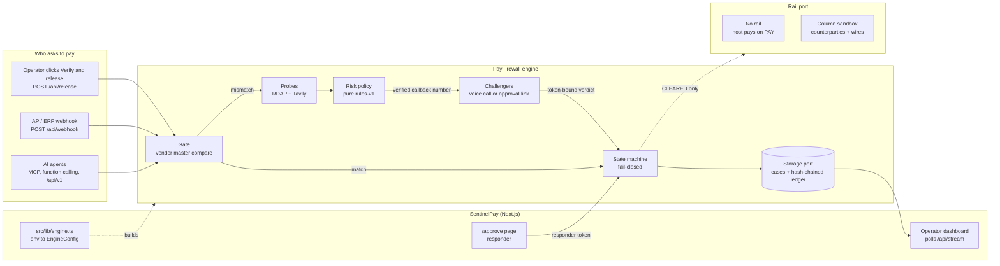
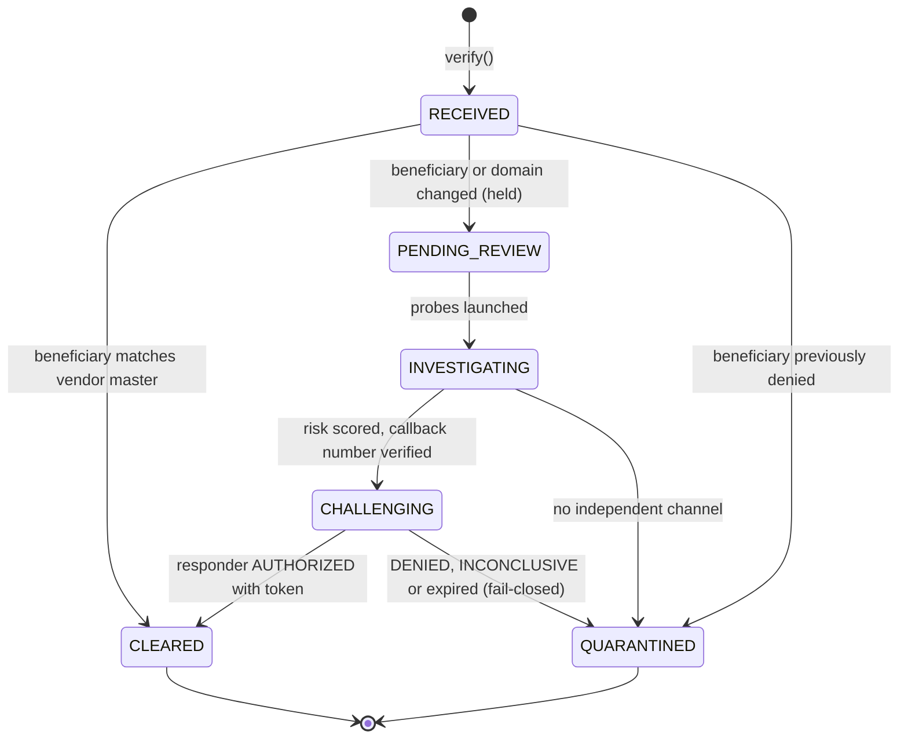
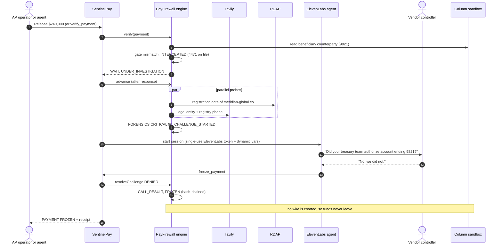

<div align="center">

# 🛡️ SentinelPay

### Stop business-email-compromise wire fraud *before* the money settles.

SentinelPay is a pre-settlement verification layer for accounts-payable wires, built on **[PayFirewall](#3-payfirewall-the-engine)**, an open-source payment firewall for AP systems and AI agents.
When a payment shows up with **changed bank details**, it holds the wire, investigates the request,
**gets the vendor's real controller to confirm** on an independently sourced number, and freezes or releases the
payment. Every step is written to a tamper-evident audit trail.

**LOCK IN Hack · September 12–13, 2026**

### [▶ Live demo: sentinelpay-sigma.vercel.app](https://sentinelpay-sigma.vercel.app)

`Fintech / Money Track` · `Best Use of Tavily` · `Best ElevenLabs Project` · `Grand Prize` · `Best Solo Builder`

     


</div>

---

## Contents

1. [The problem](#1-the-problem)
2. [The solution](#2-the-solution)
3. [PayFirewall: the engine](#3-payfirewall-the-engine)
4. [Hackathon tracks](#4-hackathon-tracks)
5. [Demo walkthrough](#5-demo-walkthrough)
6. [System architecture](#6-system-architecture)
7. [By the numbers](#7-by-the-numbers)
8. [Quickstart](#8-quickstart)
9. [Deploying to Vercel](#9-deploying-to-vercel)
10. [Configuration and modes](#10-configuration-and-modes)
11. [API reference](#11-api-reference)
12. [Project structure](#12-project-structure)
13. [Testing and CI](#13-testing-and-ci)
14. [Releasing the packages](#14-releasing-the-packages)
15. [What is real, what is simulated](#15-what-is-real-what-is-simulated)
16. [Roadmap](#16-roadmap)

---

## 1. The problem

An attacker gets into a vendor's mailbox, waits for a real invoice thread, and sends accounts payable a polite note: *"We've changed banks, please use this new account."* The invoice, PO and amount are all genuine. Only the account number is new. AP updates the payee and releases the wire. On Fedwire or SWIFT that transfer is final within hours.

Every AP policy already has the right control: **confirm bank-detail changes by phone, on a number you already trust.** Under month-end volume the call gets skipped, or staff dial the "helpful" number printed in the attacker's email footer. Now AI agents are starting to pay invoices too, and an agent will follow the instructions in that email unless something stops it.

| Indicator | Figure | Source |
|---|---|---|
| US business email compromise losses, 2024 | **$2.77 billion** across **21,442** complaints | FBI IC3 2024 Internet Crime Report |
| Mean reported loss per BEC complaint | **≈ $129,000** | Derived: $2,770,151,146 ÷ 21,442 (a mean; large cases skew it upward) |
| BEC exposed losses worldwide, Oct 2013 – Dec 2023 | **$55.5 billion** across **305,033** incidents | FBI IC3 PSA I-091124 |
| All reported cybercrime losses, 2024 | **$16.6 billion** (+33% year over year) | FBI IC3 2024 |
| Organizations hit by payments-fraud attacks or attempts in 2024 | **79%** | AFP 2025 Payments Fraud and Control Survey |
| Treasury teams naming BEC as the #1 avenue for fraud attempts | **63%**, with **wires** the payment type most targeted by BEC | AFP 2025 |
| Funds frozen by the FBI Recovery Asset Team when fraud is reported fast | **$561.6 million** ($469.1M domestic + $92.5M international), **66%** success rate | FBI IC3 2024 (Financial Fraud Kill Chain) |

**The insight:** speed decides whether money comes back. When fraud is reported fast, the FBI's Recovery Asset Team froze funds in 66% of the cases it acted on. Once a wire settles and moves on, recovery rarely happens. The cheapest place to stop it is before release. The gap isn't reading the invoice. It's **independently verifying who you are about to pay**, fast enough and cheaply enough to run on every changed-beneficiary payment, not a sampled few.

## 2. The solution

SentinelPay sits between the AP system (or the paying agent) and the payment rail. It runs the verification itself, on every payment whose beneficiary changed.

| Step | What SentinelPay does | Why it's hard to fool |
|---|---|---|
| **1. Intercept** | Compares the wire's beneficiary account and request domain with the vendor master. Any mismatch holds the release. | Deterministic string comparison. There's no model to talk around. |
| **2. Investigate** | In parallel: RDAP registration age of the requesting domain, plus Tavily research to resolve the vendor's real legal entity and **registry-listed phone number**. | The callback number comes from the vendor master or SEC, OpenCorporates and Bloomberg sources. The invoice's contact number is never dialed. |
| **3. Score** | A pure, rule-based policy converts signals into LOW / ELEVATED / CRITICAL with reason codes. A probe that fails counts against the payment, never for it. | Same inputs, same score, every time. An LLM never sets the verdict. |
| **4. Challenge** | The vendor's controller confirms on a channel the requester doesn't control: an ElevenLabs voice agent call, or an approval link delivered to an internal approver who calls the verified number. | Only the responder channel holds the single-use token that can authorize. The requester, human or agent, never sees it. |
| **5. Enforce** | Anything but an explicit, token-bound authorization freezes the wire: a denial, an unclear answer, an expired challenge, five bad tokens. | Terminal states are immutable, `CLEARED` is committed before any rail call, and the rail beneficiary is re-read before release. |
| **6. Prove** | Every transition is appended to a SHA-256 hash-chained ledger, and each case produces a printable incident receipt for CFO sign-off. | Editing any past entry breaks verification from that row onward. |

### Who it serves

| User | Job to be done | What they get |
|---|---|---|
| AP specialist | "Release the batch without becoming the person who wired $240k to a money mule." | Automatic verification on every changed-beneficiary payment. No manual call. |
| Controller / CFO | "Prove to auditors we control outbound money." | A hash-chained receipt per decision, exportable as PDF. |
| The vendor's real controller | "Stop people paying an impostor in my name." | A clear out-of-band confirmation on their real number. |
| Teams building payment agents | "Let the agent pay invoices without letting an email talk it into fraud." | `npm i payfirewall` or one MCP config line: three tools and one rule. |
| AP platforms and banks | "Make autonomous payables safe to trust." | A drop-in engine with ports for storage, evidence, challenge channels and the rail. |

## 3. PayFirewall: the engine

Everything that decides whether money may move lives in two open-source npm packages. SentinelPay is one app built on them; your AP system or agent can be another.

| Package | What it is |
|---|---|
| [`payfirewall`](packages/engine) | The engine: `createEngine`, ports and adapters, tool schemas for OpenAI / Anthropic / Vercel AI SDK, an HTTP handler and client. Zero runtime dependencies, ESM + CJS. |
| [`payfirewall-mcp`](packages/mcp) | MCP server exposing the requester tools to Claude, Cursor and any MCP client. |

```bash
npm i payfirewall
```

**One line for Claude Code** (point it at any deployment that mounts the HTTP handler, such as this app's `/api/v1` when you run it; the hosted demo does not serve `/api/v1` yet):

```bash
claude mcp add payfirewall -e PAYFIREWALL_URL=https://your-app.example.com/api/v1 -e PAYFIREWALL_API_KEY=sk_... -- npx -y payfirewall-mcp
```

**Three tools, one rule: do `nextActions[0]`, and never pay unless `decision` is `PAY`.**

| Tool | Does | Can it release money? |
|---|---|---|
| `verify_payment` | Submit a payment for verification | Only by returning `PAY` after verification |
| `get_verification` | Long-poll a payment you submitted, optionally with its receipt | No |
| `block_payment` | Stop a payment you believe is fraudulent | No, only toward `DO_NOT_PAY` |

**An agent in ten lines** (Anthropic tool use; OpenAI and the AI SDK work the same way):

```ts
import Anthropic from "@anthropic-ai/sdk";
import { callTool, toAnthropicTools } from "payfirewall/tools";

const anthropic = new Anthropic();
const messages: Anthropic.MessageParam[] = [{ role: "user", content: "Pay Meridian invoice INV-2291: $240,000 to account ending 9821." }];
for (;;) {
  const res = await anthropic.messages.create({ model: "claude-opus-5", max_tokens: 16000, tools: toAnthropicTools() as Anthropic.Tool[], messages });
  messages.push({ role: "assistant", content: res.content });
  if (res.stop_reason !== "tool_use") break;
  const results: Anthropic.ToolResultBlockParam[] = [];
  for (const b of res.content) if (b.type === "tool_use") results.push({ type: "tool_result", tool_use_id: b.id, content: JSON.stringify(await callTool(engine, b.name, b.input)) });
  messages.push({ role: "user", content: results });
}
```

`engine` is `createEngine({ ... })` in-process, or `createHttpClient({ baseUrl, apiKey })` against a deployment. The 60-second quickstart, the decision contract, every integration and the security model are in the **[payfirewall README](packages/engine/README.md)**; MCP modes and client configs are in the **[payfirewall-mcp README](packages/mcp/README.md)**.

## 4. Hackathon tracks

| Track | Judging focus | How SentinelPay delivers |
|---|---|---|
| **Fintech / Money Track** | Real CFO and treasury pain; modern commercial banking | Intercepts fraud at the AP disbursement, the exact step BEC attacks, with wires the most-targeted payment type (AFP 2025). The rail is a port with a **Column bank-API sandbox** adapter: a verified release creates a sandbox wire, and a freeze never creates one. |
| **Best Use of Tavily** | Autonomous web research driving agent decisions | Tavily is load-bearing. It resolves the vendor's registered identity and **the phone number the challenge dials** when the vendor master has none. Without a trusted number there is no challenge, and the payment freezes. |
| **Best ElevenLabs Project** | Low-latency conversational AI with creative tool use | The agent is an investigator, not a reader. It runs a challenge–response call and triggers `freeze_payment` or `approve_payment` mid-conversation with dynamic per-call context (amount, vendor, account on file). |
| **Grand Prize** | Depth, end-to-end function, business model | One click takes a $240,000 wire from pending to frozen with forensics, a voice challenge and a verifiable receipt, and the same engine ships as npm packages any agent can use. Unit economics are in [§7](#7-by-the-numbers). |
| **Best Solo Builder** | Scope shipped by one person | One TypeScript repo: a deployed app, a published-ready engine and MCP server, 220 automated tests, CI with a tarball smoke test, and an offline mode that survives venue wifi. |

> The Rho API was not available to us, so the rail integration uses Column's public sandbox behind the `Rail` port. Swapping in any bank or AP API is one adapter.

## 5. Demo walkthrough

A $240,000 wire to *Meridian Global Logistics LLC* is waiting in the queue. The invoice is real, but the remittance details changed: account **••4471 → ••9821**, requested from **meridian-global.co**, a lookalike of the vendor's 27-year-old domain **meridianglobal.com**.

| | |
|---|---|
|  |  |
| **1. Pending release.** The queue flags that bank details changed on this invoice. The operator clicks **Verify and release**. | **2. Held and investigated.** The gate holds the wire and the terminal streams RDAP and Tavily findings as they land. |
|  |  |
| **3. Challenged and frozen.** Risk scores CRITICAL 90. The agent calls (312) 555-0198, the controller denies the change, `freeze_payment` fires, and the wire is frozen. | **4. Audit receipt.** Risk signals, call transcript, verdict, assurance tier and all six ledger hashes, verified and printable. |

Investigation terminal, abridged:

```text
⚠ Beneficiary changed: ••4471 → ••9821 — release held
⚠ Request domain meridian-global.co ≠ vendor of record meridianglobal.com
▶ Forensics  launching RDAP + Tavily probes in parallel
▶ RDAP    meridian-global.co … registered 72 hours ago
▶ Tavily  resolving real entity … Meridian Global Logistics LLC confirmed
▶ Tavily  meridian-global.co is not linked to Meridian Global Logistics LLC in any registry source
▶ Tavily  verified corporate line: (312) 555-0198
● Critical risk, score 90
☎ Challenge  browser voice call to the Meridian Global Logistics LLC controller at (312) 555-0198
■ Vendor controller denied the change — $240,000.00 frozen
```

The same case can be driven headlessly: an agent calls `verify_payment`, polls `get_verification` while an approver confirms through `/approve`, and gets `DO_NOT_PAY` with `VENDOR_DENIED_CHANGE`. The 3-minute stage script and judge Q&A are in [`References/DEMO_SCRIPT.md`](References/DEMO_SCRIPT.md).

## 6. System architecture

One Next.js app on one libSQL database (hosted Turso on Vercel, a local file offline), with every money decision delegated to the PayFirewall engine. Deep dive: [`docs/ARCHITECTURE.md`](docs/ARCHITECTURE.md).



### Payment lifecycle



Every non-terminal state can also be frozen with `block()`. The decision an integration acts on is derived from the state: `CLEARED` is `PAY`, `QUARANTINED` is `DO_NOT_PAY`, everything else is `WAIT`.

### One interception, end to end



### Risk policy (deterministic)

`packages/engine/src/core/policy.ts` is a pure function with no I/O and no model:

| Signal | Source | Rule | Points |
|---|---|---|---|
| Request domain age | RDAP | Registered < 30 days ago, or no registry record | **+50** |
| Entity match | Tavily | Request domain not linked to the verified legal entity | **+20** |
| Callback number | Tavily | No registry phone, or it differs from the invoice phone | **+20** |
| Sanctions | OpenSanctions *(planned)* | Beneficiary on a sanctions list | **+40** |

**Level:** score ≥ 60 → CRITICAL · ≥ 30 → ELEVATED · else LOW. The demo scenario scores 50 + 20 + 20 = **90**. A signal no probe produced counts as adverse. The score never decides alone: every beneficiary change still requires out-of-band confirmation.

### The responder-token rule

When a challenge opens, the engine mints a single-use responder token, stores only its peppered hash, and hands the plaintext to the challenge channel alone: the approval link's URL fragment, or the operator's voice session. `AUTHORIZED` is accepted only with that token. It never appears in a verification, receipt, ledger entry, log line or tool schema, so a requesting agent has nothing to leak and nothing to forge. An authenticated responder who is also the requester is refused (`SELF_APPROVAL_FORBIDDEN`), and structured answers can only downgrade a verdict.

| Assurance tier | Channel | Production |
|---|---|---|
| `test` | scripted challenger | Refused |
| `operator_session` | ElevenLabs voice call from the operator's browser; the vendor must read back the new account's last 4 digits | Only from a caller holding an operator API key, which `/api/voice/token` and `/api/governor/decide` require; that operator is the responder, so self-approval is refused. The bundled dashboard has no operator sign-in, so it cannot clear a voice challenge in production. |
| `out_of_band` | approval link to an internal approver, phone | Allowed |

### Tamper-evident audit ledger

```text
entryHash = SHA-256( seq | paymentId | event | payloadJson | prevHash )     genesis prevHash = 0×64
```

Each case write and its ledger entries commit in one compare-and-set transaction, so concurrent requests can't double-apply a step or fork the chain. `verifyLedger()` recomputes every hash; change one historical payload and the dashboard header flips to **"Audit chain broken at #n"**. The test suite proves it.

### Stack

| Layer | Choice | Why |
|---|---|---|
| Engine | `payfirewall` (TypeScript, zero runtime deps, Web Crypto + `fetch`) | Same decisions for the dashboard, agents and HTTP |
| Agent surface | `payfirewall-mcp`, OpenAI / Anthropic / AI SDK tool adapters, HTTP v1 + OpenAPI | One schema source, no drift |
| App | Next.js 16 (App Router), React 19, TypeScript strict | UI and API in one deployment |
| State | libSQL (`@libsql/client`): hosted Turso in production, local SQLite file offline | Same SQL everywhere; shared state across serverless instances |
| Hosting | Vercel (Fluid compute, `after()` for background steps) | HTTPS for the browser microphone, zero-ops deploys |
| UI | Tailwind CSS 4, Framer Motion, self-hosted IBM Plex and JetBrains Mono | Renders identically offline |
| Research | Tavily Search API (`search_depth: advanced`) | Registry-restricted identity and phone resolution |
| Domain intel | RDAP via rdap.org | Free, no key, authoritative registration dates |
| Voice | ElevenLabs Agents (`@elevenlabs/react`, WebRTC, client tools) | Low-latency challenge call with tool calls |
| Rail | Column sandbox (`PAYMENT_SOURCE=column`) or none | Real bank-API semantics without real money |
| Tests and packaging | `node:test` via `tsx`, tsup, publint, attw, GitHub Actions | No extra test framework; tarballs verified before publish |

## 7. By the numbers

### Measured on this codebase

| Metric | Result | How it was measured |
|---|---|---|
| Gate decision | **0.3 ms** median | 20 runs, offline fixtures (`DEMO_PACE_MS=0`), before the engine extraction |
| Forensics, cached data | **9 ms** median | Same benchmark: RDAP + Tavily extraction + policy + ledger writes |
| Forensics, live RDAP | **~150 ms** | Live rdap.org lookup; Tavily on fixtures (no key during the benchmark) |
| Governor decision + ledger append | **0.5 ms** median | Same benchmark |
| Click → frozen, full demo run | **~30 s** | Browser run. Dominated by the ~23 s voice call and deliberate 0.9 s terminal pacing for the audience |
| Coverage | **100%** of beneficiary-changed payments | By construction: every gate mismatch is challenged; no sampling |
| Audit entries per intercepted payment | **6**, hash-chained | `INTERCEPTED → INVESTIGATION_STARTED → FORENSICS → CHALLENGE_STARTED → CALL_RESULT → FROZEN` |
| Automated tests | **220 passing** | Engine core, adapters, tools, HTTP, MCP server and stdio end to end, app compatibility (see [§13](#13-testing-and-ci)) |

### Unit economics (estimate)

| Component | Usage per verification | Cost |
|---|---|---|
| RDAP | 1 lookup | $0 |
| Tavily | 2 advanced searches × 2 credits × $0.008 | **$0.032** |
| ElevenLabs Agents | ~1 minute at $0.08–0.12/min | **$0.08–0.12** |
| **Total** | | **≈ $0.11–0.15**, plus LLM tokens billed separately |

The single $240,000 wire in the demo would pay for about **1.6 million verifications** at $0.15 each. Even against the mean reported BEC loss (≈ $129,000), one prevented incident covers roughly **860,000**. That supports simple pricing, per verified payment or as basis points on protected volume.

## 8. Quickstart

**Prerequisites:** Node 20+ and pnpm (`npm i -g pnpm`). No API keys needed for the offline demo.

```bash
git clone https://github.com/roshaninfordham/sentinelpay.git
cd sentinelpay
pnpm install
cp .env.example .env.local     # DEMO_MODE=cache by default, runs with zero keys
pnpm seed                      # writes the demo scenario to sentinel.db (or Turso if TURSO_DATABASE_URL is set)
pnpm dev                       # http://localhost:3000
```

Click **Verify and release** on the $240,000 Meridian wire. **Reset demo** (top right) restores the scenario. The $18,450 Northwind wire is the clean control and passes straight through the gate.

**Try the headless path.** Add an API key and the approval channel to `.env.local`, then restart:

```bash
SENTINELPAY_API_KEYS=sk_local_agent:agent:local-agent:requester
APPROVAL_DELIVERY=log
```

```bash
curl -s localhost:3000/api/v1/verifications -H 'authorization: Bearer sk_local_agent' -H 'content-type: application/json' -d '{
  "payment": { "id": "pay_agent_1", "vendorId": "v_meridian", "amountCents": 5000000, "currency": "USD",
               "beneficiary": { "accountLast4": "1111" }, "requestSourceDomain": "meridian-global.co" } }'
curl -s 'localhost:3000/api/v1/verifications/pay_agent_1?waitMs=10000&sinceVersion=1' -H 'authorization: Bearer sk_local_agent'
```

The server log prints the approval link; open it to confirm or deny as the approver, then poll again.

## 9. Deploying to Vercel

The production deployment at **[sentinelpay-sigma.vercel.app](https://sentinelpay-sigma.vercel.app)** runs this repo on Vercel with a Turso database from the Vercel Marketplace.

```bash
vercel link                                        # link the project
vercel integration add tursocloud/database         # hosted libSQL; injects TURSO_DATABASE_URL + TURSO_AUTH_TOKEN
vercel env add DEMO_MODE production                # live
vercel env add TAVILY_API_KEY production
vercel env add ELEVENLABS_API_KEY production
vercel env add ELEVENLABS_AGENT_ID production
vercel env add SENTINELPAY_TOKEN_PEPPER production # openssl rand -base64 48
vercel env add SENTINELPAY_API_KEYS production     # optional: keys for agents and payfirewall-mcp
vercel env add COLUMN_API_KEY production           # optional: test_… sandbox key
vercel env add COLUMN_SANDBOX_CONFIG production    # optional: JSON printed by `pnpm column:setup`
vercel env add PAYMENT_SOURCE production           # column (or mock)
vercel deploy --prod
```

Seed the hosted database once. The dashboard also auto-seeds an empty database on first load.

```bash
vercel env pull .env.turso.tmp --environment development
set -a; . ./.env.turso.tmp; set +a; pnpm seed; rm .env.turso.tmp
```

Why Turso: serverless instances don't share a filesystem, so a local SQLite file can't hold state across the release request, the background engine steps and the dashboard poll. libSQL keeps the exact same SQL and still runs against a local file for the offline demo. `.vercelignore` keeps `.env*` and local databases out of CLI uploads.

The public demo runs with `SENTINELPAY_ENVIRONMENT=sandbox`. It was deployed before the `/api/v1` mount: `/api/v1/health`, `/api/v1/tools` and `/api/v1/openapi.json` return 404 there until the current `main` is redeployed, so point agents and `payfirewall-mcp` at a local or self-hosted instance for now. Each run spends Tavily and ElevenLabs credits; **Reset demo** restores the scenario for the next viewer.

## 10. Configuration and modes

All settings live in `.env.local`. [`.env.example`](.env.example) documents every variable.

| Variable | Values | Effect |
|---|---|---|
| `DEMO_MODE` | `cache` *(default)* / `live` | `cache` uses fixtures only and survives a wifi drop. `live` calls real APIs and falls back to fixtures per call on failure. |
| `SENTINELPAY_ENVIRONMENT` | `sandbox` *(default)* / `test` / `production` | Production refuses unsafe configuration: no token pepper, `APPROVAL_DELIVERY=log`, test challengers, fixture evidence clearing a payment, an open voice token route. |
| `SENTINELPAY_TOKEN_PEPPER` | ≥ 32 bytes | Pepper for responder-token hashes. Required in production. |
| `SENTINELPAY_API_KEYS` | `key:kind:id:role,…` | Principals for `/api/v1`. `kind` is `agent`, `human` or `system`; `role` is `requester`, `operator` or `requester+operator`. |
| `APPROVAL_DELIVERY` | empty / `log` | `log` enables the approval-link challenger and prints links to the server log (sandbox and test only). |
| `APPROVAL_BASE_URL` | URL | Base of delivered `/approve` links. Defaults to the Vercel URL or localhost. |
| `PAYMENT_SOURCE` | `mock` *(default)* / `column` | `column` attaches the Column sandbox rail. |
| `DEMO_PACE_MS` | ms, default `900` | Delay between terminal lines so an audience can follow. |
| `TURSO_DATABASE_URL`, `TURSO_AUTH_TOKEN` | | Hosted libSQL. Unset means a local `sentinel.db`. |
| `TAVILY_API_KEY` | `tvly-…` | Live entity and phone resolution. |
| `ELEVENLABS_API_KEY`, `ELEVENLABS_AGENT_ID` | | Live voice agent. Without them, a scripted call drives the same tools. |
| `COLUMN_API_KEY` | `test_…` only | Column sandbox rail. Live keys are refused in code. |
| `PAYER_COMPANY_NAME` | default `Acme Corp` | Who the challenge says it's calling for. |

The dashboard header always shows the active mode: **Mock rail / Column sandbox rail** and **Offline fixtures / Live data**. Cached terminal lines are tagged `[cached]`.

### Enable the live voice agent (ElevenLabs)

1. Create an agent and paste the prompt, first message and dynamic variables from [`src/lib/voice/agent.config.md`](src/lib/voice/agent.config.md).
2. Add **both** client tools, `freeze_payment` and `approve_payment`, on the agent in the ElevenLabs dashboard. Defining them only in code isn't enough.
3. Enable authentication, then set `ELEVENLABS_API_KEY`, `ELEVENLABS_AGENT_ID` and `DEMO_MODE=live`. The server mints a single-use conversation token per call, so the API key never reaches the browser.

### Enable the Column sandbox rail

[Column](https://column.com) is a US bank whose developer sandbox is free and self-serve: every API route works and state persists like production, but no real money moves.

1. Sign up at [dashboard.column.com](https://dashboard.column.com) and copy the **sandbox** API key (`test_…`).
2. Put `COLUMN_API_KEY=test_…` in `.env.local` and run `pnpm column:setup`. It:
   - creates an "AP operating" bank account and funds it with a simulated $1,000,000 incoming wire;
   - creates counterparties for each vendor's account on file (••4471, ••2208) and for the attacker's account from the poisoned invoice (••9821);
   - writes the object ids to `.column-sandbox.json` (gitignored, no secrets).
3. Set `PAYMENT_SOURCE=column` and `DEMO_MODE=live`, then `pnpm seed && pnpm dev`.
4. On Vercel: add `COLUMN_API_KEY`, and paste the one-line JSON that setup prints as `COLUMN_SANDBOX_CONFIG`. Serverless functions have no local file to read.

On this rail the engine reads the beneficiary from Column's counterparty record before the gate, and again before release. A cleared payment creates a sandbox wire, whose id is logged in the ledger (`RAIL_RELEASED`) and on the receipt. A frozen payment never calls the wire endpoint.

> **Status:** the Column adapter follows Column's published docs and is covered by stubbed-HTTP tests, but it has **not yet been run against a real `test_` key**. Three details are inferred rather than confirmed by the docs we could reach: the `GET /counterparties/{id}` path, the `GET /entities` response shape, and the `Idempotency-Key` header. Expect small fixes on first run.

## 11. API reference

### `/api/v1`: PayFirewall HTTP contract

Mounted from `payfirewall/http` at `app/api/v1/[...path]/route.ts`. Requester routes need `Authorization: Bearer <key>` from `SENTINELPAY_API_KEYS`. Not yet live on the hosted demo (see [§9](#9-deploying-to-vercel)); run the app locally to use it.

| Method | Route | Purpose |
|---|---|---|
| `POST` | `/api/v1/verifications` | `{ payment, waitMs? }` → `Verification`. `Idempotency-Key` header supported. 201 new, 200 existing. |
| `GET` | `/api/v1/verifications/{paymentId}` | Current `Verification`. `?waitMs=&sinceVersion=` long-poll, `ETag` / `304`, `Retry-After` while `WAIT`. |
| `POST` | `/api/v1/verifications/{paymentId}/block` | `{ reason }` → frozen `Verification` |
| `GET` | `/api/v1/verifications/{paymentId}/receipt` | Receipt with ledger entries and chain check |
| `POST` | `/api/v1/challenges/{challengeId}/result` | Responder ingress. `AUTHORIZED` with the responder token as bearer (and the vendor's read-back); `DENIED` / `INCONCLUSIVE` with an API key. |
| `GET` | `/api/v1/ledger/verify` | `{ ok, brokenAt?, length }` for the whole chain |
| `GET` | `/api/v1/tools` · `/api/v1/openapi.json` · `/api/v1/health` | Tool definitions, OpenAPI 3.1, active configuration. No auth. |

Errors are `{ "error": { "code", "message", "retryable", "nextActions" } }`, and `nextActions` never says `PAY`.

### Responder page

| Method | Route | Purpose |
|---|---|---|
| `GET` | `/approve/{challengeId}#t=<token>` | The approver's confirmation page. The token stays in the URL fragment, which never reaches the server; the server renders the same neutral shell for every id, and the page loads the payment details with the token. |
| `GET` | `/api/approve/{challengeId}` | Details for that page (amount, vendor, account on file, verified number, expiry), or `expired` / `closed`. Responder token as bearer; any bad token or unknown id gets the same 401. |
| `POST` | `/api/approve/{challengeId}` | "Vendor did not confirm" from that page (`DENIED` / `INCONCLUSIVE` only), responder token as bearer. Refused in production until approver sessions exist. |

### Dashboard routes

These act as the dashboard's own principals, so in production every one of them except `/api/reset` requires `Authorization: Bearer <operator key>` from `SENTINELPAY_API_KEYS` (401 without a key, 403 without the operator role), and `/api/reset`, `/` and `/incident/{id}` are not served. Integrations use `/api/v1`.

| Method | Route | Purpose |
|---|---|---|
| `POST` | `/api/release` | `{ paymentId }` → `verify()` for a queued payment. Schedules the next engine step on mismatch. |
| `POST` | `/api/webhook` | Ingest a disbursement from an AP/ERP system, then `verify()`. `requestSourceDomain` must be a hostname. |
| `POST` | `/api/investigate` | `{ paymentId }` → advance a held payment through forensics and return the `RiskAssessment`. |
| `POST` | `/api/block` | `{ paymentId }` → "Freeze now" from the operator console. |
| `GET` | `/api/voice/token?paymentId=` | Challenge id, responder token and dynamic variables for the open voice challenge, plus a single-use ElevenLabs token or `mode: "simulated"`. The new account's digits are never a dynamic variable, and `request_domain` is passed only when it is a bare hostname. |
| `POST` | `/api/governor/decide` | Voice tool outcome. `DENIED` / `INCONCLUSIVE` as before; `AUTHORIZED` requires `challengeId` + `responderToken` and `beneficiaryLast4ReadBack` matching the new account, else the wire freezes. |
| `GET` | `/api/incident/{id}` | JSON incident receipt with chain verification. |
| `GET` | `/incident/{id}` | Printable receipt (browser print → PDF). |
| `GET` | `/api/stream` | Dashboard snapshot: payments, timeline, assessments, calls, ledger, chain status (the full chain is re-verified when an entry is written and at least every 60 s). Polled every second while a wire is being verified, every 5 s otherwise. |
| `POST` | `/api/reset` | Re-seed the demo scenario. 404 in production. |

Authorization without the responder token is refused, whichever route it comes through. On a payment that is waiting for the challenge:

```bash
curl -s -X POST localhost:3000/api/governor/decide -H 'content-type: application/json' \
  -d '{"paymentId":"pay_240k","verdict":"AUTHORIZED"}'
# → 403 {"error":"AUTHORIZED requires challengeId and responderToken"}
```

## 12. Project structure

```text
sentinelpay/
├─ app/
│  ├─ page.tsx                      operator dashboard
│  ├─ approve/[challengeId]/        responder page for approval links
│  ├─ incident/[id]/                printable incident receipt
│  └─ api/
│     ├─ v1/[...path]/              PayFirewall HTTP contract (createHandler)
│     ├─ approve/[challengeId]/     "not confirmed" from the approval page
│     ├─ release/  webhook/  investigate/  block/
│     ├─ voice/token/  governor/decide/
│     └─ incident/[id]/  stream/  reset/
├─ src/
│  ├─ lib/
│  │  ├─ engine.ts                  env → EngineConfig → createEngine (probes, challengers, rail, API keys)
│  │  ├─ db.ts                      libSQL client and app tables
│  │  ├─ voice/                     browser-challenger.ts · tools.ts · script.ts · agent.config.md
│  │  ├─ timeline.ts · timeline-format.ts   engine events → investigation terminal
│  │  ├─ gate.ts · governor.ts · ledger.ts · receipt.ts · forensics/ · providers/   compatibility wrappers
│  │  └─ snapshot.ts · seed-data.ts · types.ts
│  └─ components/                   Dashboard · Queue · WireTicket · Terminal · CallConsole · LedgerPanel · ResolutionShield …
├─ packages/
│  ├─ engine/                       payfirewall: core · tools · http · adapters · challengers · testing
│  └─ mcp/                          payfirewall-mcp: server · bin · config
├─ scripts/                         seed.ts · column-setup.ts · capture-fixtures.ts · pack-smoke.mjs
├─ fixtures/                        rdap.json · tavily.json (offline mode)
├─ docs/                            ARCHITECTURE.md · ENGINE_SPEC.md · images/
├─ .github/workflows/ci.yml         test, typecheck, lint, build, pack smoke
└─ References/                      PRD · original architecture · build guide · demo script
```

## 13. Testing and CI

```bash
pnpm test         # 220 tests: app + both packages
pnpm typecheck    # tsc --noEmit
pnpm lint         # eslint
pnpm build        # production build
node scripts/pack-smoke.mjs   # build, pack and install both packages in a fresh project
```

| Suite | What it proves |
|---|---|
| `packages/engine/test/core` | Gate, policy, state machine, next actions, token and hash primitives; the full pipeline; fail-closed and security rules (no token leakage, no self-approval, downgrade-only answers, bad-token lockout, re-verify is operator-only, unsafe config refused); concurrent CAS commits; the memory storage contract |
| `packages/engine/test/adapters` | RDAP, Tavily and fixture probes against stubbed HTTP; libSQL storage contract; Column rail (live keys refused, beneficiary read, idempotent release, drift); ElevenLabs token minting |
| `packages/engine/test/tools` | JSON Schema validation, the OpenAI strict transform, AI SDK and Anthropic shapes, `callTool` error envelope, schema snapshots |
| `packages/engine/test/http` | Every v1 route, auth, ETag/304, responder ingress, scoped reads, and the HTTP client |
| `packages/mcp/test` | Server tools, resources and prompt; launch config; a headless agent that follows `nextActions[0]` over stdio to `PAY` or `DO_NOT_PAY` |
| `src/lib`, `src/components` | App compatibility: policy cases, the 6-event ledger chain and tamper detection, the Column provider wrapper; legacy routes refused in production without an operator key; voice read-back and operator-as-responder; the approval page's token-gated details; operator copy helpers |

[`.github/workflows/ci.yml`](.github/workflows/ci.yml) runs install (frozen lockfile), test, typecheck, lint, build and the pack smoke test on Node 22 for every push to `main` and every pull request. The pack smoke test builds both packages, packs them with `pnpm pack`, installs the tarballs with npm in a project outside the workspace, runs publint and attw, drives a denied payment to `DO_NOT_PAY` from ESM and CJS, type-checks a TypeScript consumer, imports every public subpath, and runs the `payfirewall-mcp` bin.

## 14. Releasing the packages

The workspace consumes TypeScript source: `exports` in both `package.json` files point at `src`. The published entry points (`dist` exports, the `dist/bin.js` bin) live in `publishConfig`, which **only `pnpm publish` and `pnpm pack` apply**. `npm publish` would ship a manifest pointing at files that are not in the tarball, and would leave `payfirewall-mcp`'s `workspace:*` dependency unresolved.

1. Bump `version` in `packages/engine/package.json` and `packages/mcp/package.json` (keep them in step; `payfirewall-mcp` depends on the matching `payfirewall`).
2. `node scripts/pack-smoke.mjs` must pass.
3. Publish the engine first, then the MCP server:

```bash
pnpm --filter payfirewall publish --access public
pnpm --filter payfirewall-mcp publish --access public
```

`prepublishOnly` rebuilds `dist` in each package; `pnpm publish` rewrites `workspace:*` to the published `payfirewall` version. Remove the `dist` folders afterwards, or leave them: they are gitignored.

## 15. What is real, what is simulated

Judges ask. Here are straight answers.

| Component | Status |
|---|---|
| PayFirewall engine: gate, risk policy, state machine, responder tokens, hash-chained ledger, receipts | **Real** and fully implemented, with 220 tests |
| `payfirewall` and `payfirewall-mcp` packages | **Real and publish-ready**: built, packed, installed from tarballs and exercised in CI. Not yet published to npm at the time of writing. |
| MCP server | **Real.** Tested end to end over stdio in embedded mode, and against the HTTP contract in remote mode. |
| RDAP domain-age lookups | **Real**. `meridianglobal.com` resolves live (registered 1999-02-27). rdap.org has no RDAP server for `.co`, so the lookalike `meridian-global.co` uses a scenario fixture ("72 hours ago", relative to now). |
| Tavily entity resolution | **Real code path** in live mode. The demo vendor is fictional, so `fixtures/tavily.json` is authored scenario data in Tavily's response shape. `(312) 555-0198` is a reserved fictional 555 number. `pnpm capture --write-tavily` records real responses. |
| ElevenLabs voice agent | **Real integration** (token route, WebRTC session, client tools). Without keys, a scripted call with browser speech drives the identical tools, and the receipt labels it scripted. The agent never says the new account's digits; the vendor reads them back and a mismatch freezes the wire. Assurance tier: `operator_session`, because the operator's browser places the call. |
| Approval links | **Real challenger and responder page**, but delivery is `APPROVAL_DELIVERY=log`: the link is printed to the server log, which is only acceptable in sandbox and is refused in production. A production deployment needs a real delivery channel. |
| Production approvals | **Not ready yet.** Production requires an authenticated approver session to authorize through a link, and the app has API-key principals only; until approver sessions exist, production challenges can only be denied or expire. The operator console has no sign-in either, so production serves it only as a notice and its routes only to operator API keys. |
| Payment rail | **No rail** by default (PayFirewall decides, the demo pays nothing) or the **Column sandbox** adapter. The Column adapter is implemented and unit-tested against stubbed HTTP but not yet run with a real sandbox key (see [§10](#enable-the-column-sandbox-rail)). In production the bank or AP system honors the hold. |
| AP disbursement feed | Seeded scenario plus the `/api/webhook` ingest endpoint |

## 16. Roadmap

- **Approver sessions:** authenticated responders on `/approve`, which unlocks production approvals
- **Real approval delivery:** email, Slack or SMS delivery for `humanApprovalChallenger`, replacing `APPROVAL_DELIVERY=log`
- **Sanctions and mule screening:** OpenSanctions probe feeding the existing `sanctions_hit` rule
- **Phone mode:** a server-side `voice_phone` challenger (ElevenLabs + Twilio outbound) at `out_of_band` assurance
- **Ledger anchoring:** publish `ledgerHeadHash` outside the database
- **More storage adapters:** Postgres behind the `Storage` port and its contract suite
- **Connectors:** NetSuite, QuickBooks and Bill.com payables events into `/api/v1`

---

<div align="center">

Built solo by **Roshan Sharma** for LOCK IN Hack 2026 · [MIT License](LICENSE)

</div>

### Sources

- FBI IC3, *2024 Internet Crime Report* (April 2025). BEC $2,770,151,146 / 21,442 complaints; Recovery Asset Team figures: https://www.ic3.gov/AnnualReport/Reports/2024_IC3Report.pdf
- FBI IC3 PSA I-091124-PSA, *Business Email Compromise: The $55 Billion Scam*: https://www.ic3.gov/PSA/2024/PSA240911
- Nacha, *FBI's IC3 finds almost $8.5 billion lost to BEC in the last three years*: https://www.nacha.org/news/fbis-ic3-finds-almost-85-billion-lost-business-email-compromise-last-three-years
- AFP, *2025 Payments Fraud and Control Survey* (highlights via Truist): https://www.truist.com/content/dam/truist-bank/us/en/documents/info/cci/2025-afp-payments-fraud-control-survey-report-key-highlights.pdf
- Tavily credits and pricing: https://docs.tavily.com/documentation/api-credits
- ElevenLabs Agents pricing: https://elevenlabs.io/pricing/agents
- Column sandbox and testing: https://docs.column.com/guides/sandbox-and-testing
