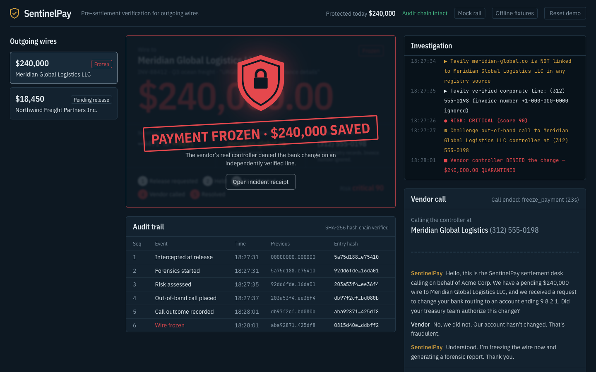
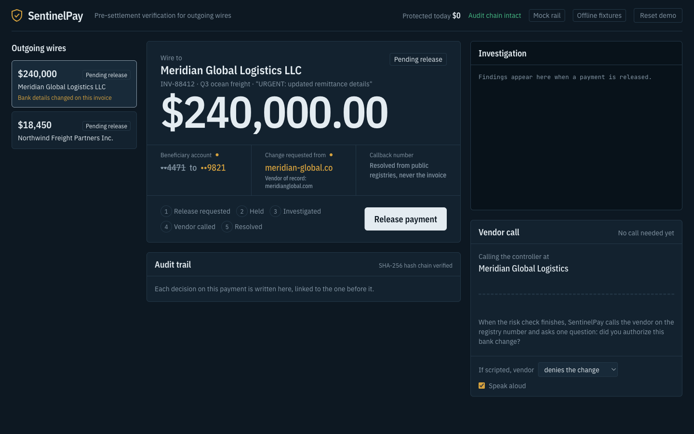
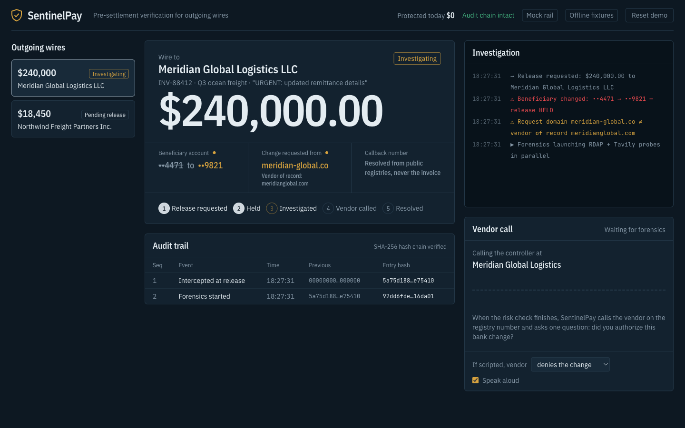
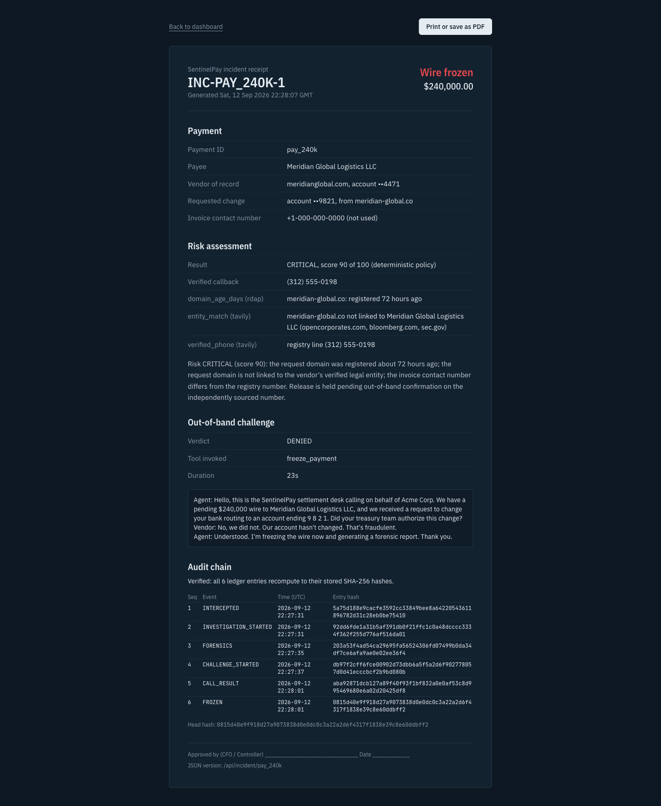
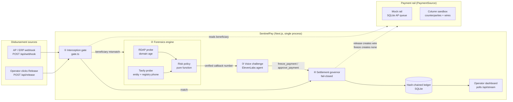
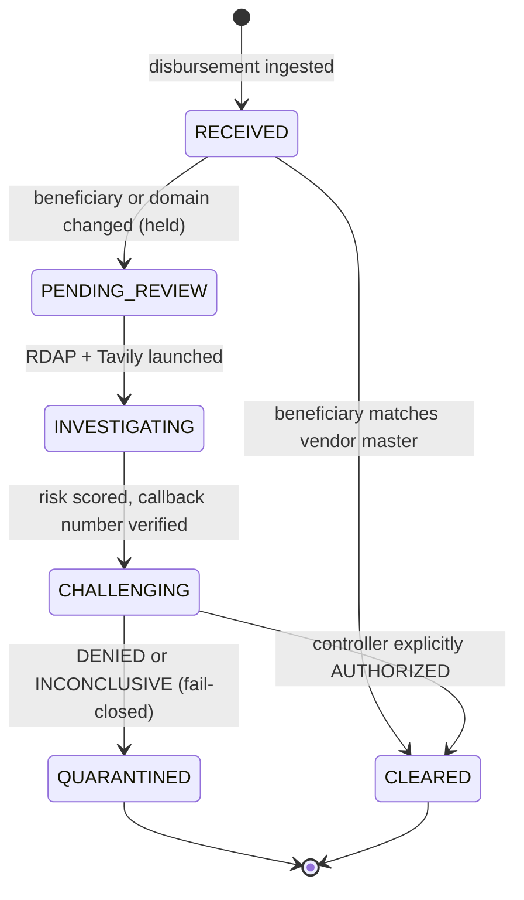
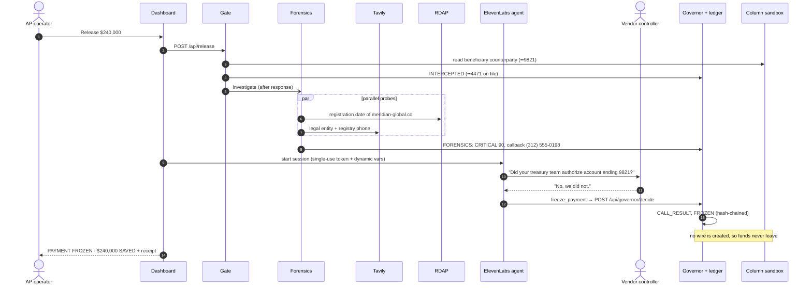

<div align="center">

# 🛡️ SentinelPay

### Stop business-email-compromise wire fraud *before* the money settles.

SentinelPay is a pre-settlement verification layer for corporate accounts-payable wires.
When a payment shows up with **changed bank details**, it holds the wire, investigates the request,
**calls the vendor's real controller** on an independently sourced number, and freezes or releases the
payment. Every step is written to a tamper-evident audit trail.

**LOCK IN Hack · September 12–13, 2026**

`Fintech / Money Track` · `Best Use of Tavily` · `Best ElevenLabs Project` · `Grand Prize` · `Best Solo Builder`

   



</div>

---

## Contents

1. [The problem](#1-the-problem)
2. [The solution](#2-the-solution)
3. [Hackathon tracks](#3-hackathon-tracks)
4. [Demo walkthrough](#4-demo-walkthrough)
5. [System architecture](#5-system-architecture)
6. [By the numbers](#6-by-the-numbers)
7. [Quickstart](#7-quickstart)
8. [Configuration and modes](#8-configuration-and-modes)
9. [API reference](#9-api-reference)
10. [Project structure](#10-project-structure)
11. [Testing](#11-testing)
12. [What is real, what is simulated](#12-what-is-real-what-is-simulated)
13. [Roadmap](#13-roadmap)

---

## 1. The problem

An attacker gets into a vendor's mailbox, waits for a real invoice thread, and sends accounts payable a polite note: *"We've changed banks, please use this new account."* The invoice, PO and amount are all genuine. Only the account number is new. AP updates the payee and releases the wire. On Fedwire or SWIFT that transfer is final within hours.

Every AP policy already has the right control: **confirm bank-detail changes by phone, on a number you already trust.** Under month-end volume the call gets skipped, or staff dial the "helpful" number printed in the attacker's email footer.

| Indicator | Figure | Source |
|---|---|---|
| US business email compromise losses, 2024 | **$2.77 billion** across **21,442** complaints | FBI IC3 2024 Internet Crime Report |
| Mean reported loss per BEC complaint | **≈ $129,000** | Derived: $2,770,151,146 ÷ 21,442 (a mean; large cases skew it upward) |
| BEC exposed losses worldwide, Oct 2013 – Dec 2023 | **$55.5 billion** across **305,033** incidents | FBI IC3 PSA I-091124 |
| All reported cybercrime losses, 2024 | **$16.6 billion** (+33% year over year) | FBI IC3 2024 |
| Organizations hit by payments-fraud attacks or attempts in 2024 | **79%** | AFP 2025 Payments Fraud and Control Survey |
| Treasury teams naming BEC as the #1 avenue for fraud attempts | **63%**, with **wires** the payment type most targeted by BEC | AFP 2025 |
| Funds frozen by the FBI Recovery Asset Team when fraud is reported fast | **$561.6 million** ($469.1M domestic + $92.5M international), **66%** success rate | FBI IC3 2024 (Financial Fraud Kill Chain) |

**The insight:** speed decides whether money comes back. When fraud is reported fast, the FBI's Recovery Asset Team froze funds in 66% of the cases it acted on. Once a wire settles and moves on, recovery rarely happens. The cheapest place to stop it is before release. The gap isn't reading the invoice. It's **independently verifying who you are about to pay**, fast enough and cheaply enough to run on every changed-beneficiary payment, not a sampled few.

## 2. The solution

SentinelPay sits between the AP system and the payment rail. It does the verification call itself, in under a minute, on every payment whose beneficiary changed.

| Step | What SentinelPay does | Why it's hard to fool |
|---|---|---|
| **1. Intercept** | Compares the wire's beneficiary account and request domain with the vendor master. Any mismatch holds the release. | Deterministic string comparison. There's no model to talk around. |
| **2. Investigate** | In parallel: RDAP registration age of the requesting domain, plus Tavily research to resolve the vendor's real legal entity and **registry-listed phone number**. | The callback number comes from SEC, OpenCorporates and Bloomberg sources. The invoice's contact number is ignored by design. |
| **3. Score** | A pure, rule-based policy converts signals into LOW / ELEVATED / CRITICAL with a plain-English rationale. | Same inputs, same score, every time. An LLM never sets the verdict. |
| **4. Challenge** | An ElevenLabs voice agent calls the verified number, states the payment and the requested change, and asks one yes/no question. | Verification leaves the compromised channel (email) for one the attacker doesn't control. |
| **5. Enforce** | The agent's spoken outcome fires `freeze_payment` or `approve_payment`. The governor fails closed: anything but an explicit authorization freezes the wire. | Terminal states are immutable, and approval is only accepted after a completed challenge. |
| **6. Prove** | Every transition is appended to a SHA-256 hash-chained ledger, and each case produces a printable incident receipt for CFO sign-off. | Editing any past entry breaks verification from that row onward. |

### Who it serves

| User | Job to be done | What they get |
|---|---|---|
| AP specialist | "Release the batch without becoming the person who wired $240k to a money mule." | Automatic verification on every changed-beneficiary payment. No manual call. |
| Controller / CFO | "Prove to auditors we control outbound money." | A hash-chained receipt per decision, exportable as PDF. |
| The vendor's real controller | "Stop people paying an impostor in my name." | A clear out-of-band call on their real number. |
| AP platforms and banks | "Make autonomous payables safe to trust." | A drop-in control plane with a single `PaymentSource` interface in front of the rail. |

## 3. Hackathon tracks

| Track | Judging focus | How SentinelPay delivers |
|---|---|---|
| **Fintech / Money Track** | Real CFO and treasury pain; modern commercial banking | Intercepts fraud at the AP disbursement, the exact step BEC attacks, with wires the most-targeted payment type (AFP 2025). The rail is pluggable and ships with a **Column bank-API sandbox** provider: a verified release creates a sandbox wire, and a freeze never creates one. |
| **Best Use of Tavily** | Autonomous web research driving agent decisions | Tavily is load-bearing. It resolves the vendor's registered identity and **the phone number the agent dials**. Without it there is no trusted callback number and no verification. |
| **Best ElevenLabs Project** | Low-latency conversational AI with creative tool use | The agent is an investigator, not a reader. It runs a challenge–response call and triggers `freeze_payment` mid-conversation with dynamic per-call context (amount, vendor, new account). |
| **Grand Prize** | Depth, end-to-end function, business model | One click takes a $240,000 wire from pending to frozen with forensics, a voice challenge and a verifiable receipt. Unit economics are in [§6](#6-by-the-numbers). |
| **Best Solo Builder** | Scope shipped by one person | One TypeScript repo, one process, four pipeline nodes, 10 automated tests, and an offline mode that survives venue wifi. |

> The Rho API was not available to us, so the rail integration uses Column's public sandbox behind the same `PaymentSource` interface. Swapping in any bank or AP API is one class.

## 4. Demo walkthrough

A $240,000 wire to *Meridian Global Logistics LLC* is waiting in the queue. The invoice is real, but the remittance details changed: account **••4471 → ••9821**, requested from **meridian-global.co**, a lookalike of the vendor's 27-year-old domain **meridianglobal.com**.

| | |
|---|---|
|  |  |
| **1. Pending release.** The queue flags that bank details changed on this invoice. The operator clicks **Release payment**. | **2. Held and investigated.** The gate holds the wire and the terminal streams RDAP and Tavily findings as they land. |
|  |  |
| **3. Challenged and frozen.** Risk scores CRITICAL 90. The agent calls (312) 555-0198, the controller denies the change, `freeze_payment` fires, and the wire is frozen. | **4. Audit receipt.** Risk signals, call transcript, verdict, and all six ledger hashes, verified and printable. |

Investigation terminal from a real run:

```text
⚠ Beneficiary changed: ••4471 → ••9821 — release HELD
⚠ Request domain meridian-global.co ≠ vendor of record meridianglobal.com
▶ RDAP    meridian-global.co … registered 72 hours ago
▶ RDAP    meridianglobal.com (vendor of record) … registered 27 years ago (1999-02-27)
▶ Tavily  resolving real entity … Meridian Global Logistics LLC confirmed via opencorporates.com, bloomberg.com, sec.gov
▶ Tavily  meridian-global.co is NOT linked to Meridian Global Logistics LLC in any registry source
▶ Tavily  verified corporate line: (312) 555-0198  (invoice number +1-000-000-0000 ignored)
● RISK: CRITICAL (score 90)
☎ Challenge  out-of-band call to Meridian Global Logistics LLC controller at (312) 555-0198
■ Vendor controller DENIED the change — $240,000.00 QUARANTINED
```

The 3-minute stage script and judge Q&A are in [`References/DEMO_SCRIPT.md`](References/DEMO_SCRIPT.md).

## 5. System architecture

One Next.js app, one TypeScript codebase, one SQLite file. Every external dependency has an offline fallback. Deep dive: [`docs/ARCHITECTURE.md`](docs/ARCHITECTURE.md).



### Payment lifecycle



### One interception, end to end



### Risk policy (deterministic)

`src/lib/forensics/policy.ts` is a pure function with no I/O and no model:

| Signal | Source | Rule | Points |
|---|---|---|---|
| Request domain age | RDAP | Registered < 30 days ago, or no registry record | **+50** |
| Entity match | Tavily | Request domain not linked to the verified legal entity | **+20** |
| Callback number | Tavily | Registry phone differs from the invoice phone, or none found | **+20** |
| Sanctions | OpenSanctions *(planned)* | Beneficiary on a sanctions list | **+40** |

**Level:** score ≥ 60 → CRITICAL · ≥ 30 → ELEVATED · else LOW. The demo scenario scores 50 + 20 + 20 = **90**. The score never decides alone. Every beneficiary change still requires the out-of-band confirmation.

### Tamper-evident audit ledger

```text
entryHash = SHA-256( seq | paymentId | event | JSON(payload) | prevHash )     genesis prevHash = 0×64
```

`verifyChain()` recomputes every hash on each dashboard refresh. Change one historical payload and the header flips to **"Audit chain broken at #n"**. The test suite proves it.

### Stack

| Layer | Choice | Why |
|---|---|---|
| App | Next.js 16 (App Router), React 19, TypeScript strict | UI and API in one process |
| State | SQLite via `better-sqlite3` | Zero-config, synchronous, one file |
| UI | Tailwind CSS 4, Framer Motion, self-hosted IBM Plex and JetBrains Mono | Renders identically offline |
| Research | Tavily Search API (`search_depth: advanced`) | Registry-restricted identity and phone resolution |
| Domain intel | RDAP via rdap.org | Free, no key, authoritative registration dates |
| Voice | ElevenLabs Agents (`@elevenlabs/react`, WebRTC, client tools) | Low-latency challenge call with tool calls |
| Rail | Column sandbox (`PAYMENT_SOURCE=column`) or local mock | Real bank-API semantics without real money |
| Tests | `node:test` via `tsx` | No extra framework |

## 6. By the numbers

### Measured on this codebase

| Metric | Result | How it was measured |
|---|---|---|
| Gate decision | **0.3 ms** median | 20 runs, offline fixtures (`DEMO_PACE_MS=0`) |
| Forensics, cached data | **9 ms** median | Same benchmark: RDAP + Tavily extraction + policy + ledger writes |
| Forensics, live RDAP | **~150 ms** | Live rdap.org lookup; Tavily on fixtures (no key during the benchmark) |
| Governor decision + ledger append | **0.5 ms** median | Same benchmark |
| Click → frozen, full demo run | **~30 s** | Browser run. Dominated by the ~23 s voice call and deliberate 0.9 s terminal pacing for the audience |
| Coverage | **100%** of beneficiary-changed payments | By construction: every gate mismatch is challenged; no sampling |
| Audit entries per intercepted payment | **6**, hash-chained | `INTERCEPTED → INVESTIGATION_STARTED → FORENSICS → CHALLENGE_STARTED → CALL_RESULT → FROZEN` |
| Automated tests | **10 passing** | Policy (5), ledger tamper + pipeline (2), Column rail against stubbed HTTP (3) |

### Unit economics (estimate)

| Component | Usage per verification | Cost |
|---|---|---|
| RDAP | 2 lookups | $0 |
| Tavily | 2 advanced searches × 2 credits × $0.008 | **$0.032** |
| ElevenLabs Agents | ~1 minute at $0.08–0.12/min | **$0.08–0.12** |
| **Total** | | **≈ $0.11–0.15**, plus LLM tokens billed separately |

The single $240,000 wire in the demo would pay for about **1.6 million verifications** at $0.15 each. Even against the mean reported BEC loss (≈ $129,000), one prevented incident covers roughly **860,000**. That supports simple pricing, per verified payment or as basis points on protected volume.

## 7. Quickstart

**Prerequisites:** Node 20+ and pnpm (`npm i -g pnpm`). No API keys needed for the offline demo.

```bash
git clone https://github.com/roshaninfordham/sentinelpay.git
cd sentinelpay
pnpm install
cp .env.example .env.local     # DEMO_MODE=cache by default, runs with zero keys
pnpm seed                      # writes sentinel.db with the demo scenario
pnpm dev                       # http://localhost:3000
```

Click **Release payment** on the $240,000 Meridian wire. **Reset demo** (top right) restores the scenario. The $18,450 Northwind wire is the clean control and passes straight through the gate.

## 8. Configuration and modes

All settings live in `.env.local`. See [`.env.example`](.env.example).

| Variable | Values | Effect |
|---|---|---|
| `DEMO_MODE` | `cache` *(default)* / `live` | `cache` uses fixtures only and survives a wifi drop. `live` calls real APIs and falls back to fixtures per call on failure. |
| `PAYMENT_SOURCE` | `mock` *(default)* / `column` | Which rail the gate reads and the governor enforces on. |
| `DEMO_PACE_MS` | ms, default `900` | Delay between terminal lines so an audience can follow. |
| `TAVILY_API_KEY` | `tvly-…` | Live entity and phone resolution. |
| `ELEVENLABS_API_KEY`, `ELEVENLABS_AGENT_ID` | | Live voice agent. Without them, a scripted call drives the same tools. |
| `COLUMN_API_KEY` | `test_…` only | Column sandbox rail. Live keys are refused in code. |
| `PAYER_COMPANY_NAME` | default `Acme Corp` | Who the agent says it's calling for. |

The dashboard header always shows the active mode: **Mock rail / Column sandbox rail** and **Offline fixtures / Live data**. Cached terminal lines are tagged `[cached]`.

### Enable the live voice agent (ElevenLabs)

1. Create an agent and paste the prompt, first message and dynamic variables from [`src/lib/voice/agent.config.md`](src/lib/voice/agent.config.md).
2. Add **both** client tools, `freeze_payment` and `approve_payment`, on the agent in the ElevenLabs dashboard. Defining them only in code isn't enough.
3. Enable authentication, then set `ELEVENLABS_API_KEY`, `ELEVENLABS_AGENT_ID` and `DEMO_MODE=live`. The server mints a single-use conversation token per call, so the API key never reaches the browser.

### Enable the Column sandbox rail

[Column](https://column.com) is a US bank whose developer sandbox is free and self-serve: every API route works and state persists like production, but no real money moves.

1. Sign up at [dashboard.column.com](https://dashboard.column.com) and copy the **sandbox** API key (`test_…`).
2. Put `COLUMN_API_KEY=test_…` in `.env.local` and run `pnpm column:setup`. It:
   - creates an "AP operating" bank account and funds it with a simulated $1,000,000 incoming wire;
   - creates counterparties for each vendor's account on file (••4471, ••2208) and for the attacker's account from the poisoned invoice (••9821);
   - writes the object ids to `.column-sandbox.json` (gitignored, no secrets).
3. Set `PAYMENT_SOURCE=column` and `DEMO_MODE=live`, then `pnpm seed && pnpm dev`.

On this rail the gate reads the beneficiary from Column's counterparty record, not a local copy. A cleared payment creates a real sandbox wire, whose id is logged in the ledger (`RAIL_RELEASED`) and on the receipt. A frozen payment never calls the wire endpoint.

> **Status:** the Column client follows Column's published docs and is covered by stubbed-HTTP tests, but it has **not yet been run against a real `test_` key**. Three details are inferred rather than confirmed by the docs we could reach: the `GET /counterparties/{id}` path, the `GET /entities` response shape, and the `Idempotency-Key` header. Expect small fixes on first run.

## 9. API reference

| Method | Route | Purpose |
|---|---|---|
| `POST` | `/api/release` | `{ paymentId }` → runs the gate. Schedules forensics on mismatch. |
| `POST` | `/api/webhook` | Ingest a `Payment`-shaped disbursement from an AP/ERP system, then run the gate. |
| `POST` | `/api/investigate` | `{ paymentId }` → run forensics synchronously and return the `RiskAssessment`. |
| `GET` | `/api/voice/token?paymentId=` | Single-use ElevenLabs conversation token and dynamic variables, or `mode: "simulated"`. |
| `POST` | `/api/governor/decide` | `{ paymentId, verdict, toolInvoked, transcript, durationSec }` → freeze or release. |
| `GET` | `/api/incident/{id}` | JSON incident receipt with chain verification. |
| `GET` | `/incident/{id}` | Printable receipt (browser print → PDF). |
| `GET` | `/api/stream` | Dashboard snapshot: payments, timeline, assessments, calls, ledger, chain status. |
| `POST` | `/api/reset` | Re-seed the demo scenario. |

Example: post a poisoned disbursement from an AP system:

```bash
curl -X POST localhost:3000/api/webhook -H 'content-type: application/json' -d '{
  "id": "pay_new", "vendorId": "v_meridian", "amountCents": 5000000,
  "claimedBankLast4": "1111", "requestSourceDomain": "meridian-global.co",
  "invoiceContactPhone": "+1-000-000-0000"
}'
# → 202 {"status":"PENDING_REVIEW","mismatches":["Beneficiary changed: ••4471 → ••1111", …]}
```

The governor refuses an authorization that skipped the challenge:

```bash
curl -X POST localhost:3000/api/governor/decide -H 'content-type: application/json' \
  -d '{"paymentId":"pay_new","verdict":"AUTHORIZED"}'
# → 409 {"error":"authorization requires a completed out-of-band challenge"}
```

The challenge call runs in the operator's browser, so the dashboard must be open for a payment to move past `CHALLENGING`. `pnpm test` covers the full server path without a browser.

## 10. Project structure

```text
sentinelpay/
├─ app/
│  ├─ page.tsx                      dashboard (server-renders the first snapshot)
│  ├─ incident/[id]/page.tsx        printable incident receipt
│  └─ api/
│     ├─ release/  webhook/         ① ingest + gate
│     ├─ investigate/               ② forensics
│     ├─ voice/token/               ③ ElevenLabs session token
│     ├─ governor/decide/           ④ freeze / release
│     ├─ incident/[id]/  stream/  reset/
├─ src/
│  ├─ lib/
│  │  ├─ types.ts                   shared contracts (Payment, RiskAssessment, LedgerEntry …)
│  │  ├─ gate.ts  governor.ts  ledger.ts  receipt.ts  snapshot.ts
│  │  ├─ forensics/                 rdap.ts · tavily.ts · policy.ts · index.ts
│  │  ├─ voice/                     tools.ts · script.ts · agent.config.md
│  │  └─ providers/                 mock.ts · column.ts · column-client.ts · column-config.ts
│  └─ components/                   Dashboard · Queue · WireTicket · Terminal · CallConsole · Waveform · LedgerPanel · ResolutionShield
├─ scripts/                         seed.ts · column-setup.ts · capture-fixtures.ts
├─ fixtures/                        rdap.json · tavily.json (offline mode)
├─ docs/                            ARCHITECTURE.md · images/
└─ References/                      PRD · original architecture · build guide · demo script
```

## 11. Testing

```bash
pnpm test        # 10 tests
pnpm typecheck   # tsc --noEmit
pnpm lint        # eslint
pnpm build       # production build
```

| Suite | What it proves |
|---|---|
| `policy.test.ts` | Clean → LOW 0; lookalike domain → CRITICAL 90; no registry record → +50; sanctions → ELEVATED 40; determinism |
| `ledger.test.ts` | A valid chain verifies, and editing one row breaks it at that row. Full pipeline: gate → forensics → deny → QUARANTINED with 6 chained events. Terminal states are immutable. Authorization without a challenge is refused. |
| `column.test.ts` | Live keys are refused. The beneficiary is read from Column. Release sends a Basic-auth, idempotent wire request with the right amount and counterparty. A freeze makes zero wire calls. |

## 12. What is real, what is simulated

Judges ask. Here are straight answers.

| Component | Status |
|---|---|
| Interception gate, risk policy, governor, hash-chained ledger, receipts | **Real** and fully implemented |
| RDAP domain-age lookups | **Real**. `meridianglobal.com` resolves live (registered 1999-02-27). rdap.org has no RDAP server for `.co`, so the lookalike `meridian-global.co` uses a scenario fixture ("72 hours ago", relative to now). |
| Tavily entity resolution | **Real code path** in live mode. The demo vendor is fictional, so `fixtures/tavily.json` is authored scenario data in Tavily's response shape. `(312) 555-0198` is a reserved fictional 555 number. `pnpm capture --write-tavily` records real responses. |
| ElevenLabs voice agent | **Real integration** (token route, WebRTC session, client tools). Without keys, a scripted call with browser speech drives the identical tools. |
| Payment rail | **Local mock** (used in the demo) or the **Column sandbox** provider. The Column provider is implemented and unit-tested against stubbed HTTP but not yet run with a real sandbox key (see [§8](#enable-the-column-sandbox-rail)). SentinelPay is a control plane: in production the bank or AP system honors its hold. |
| AP disbursement feed | Seeded scenario plus the `/api/webhook` ingest endpoint |

## 13. Roadmap

- **Sanctions and mule screening:** OpenSanctions probe feeding the existing `sanctions_hit` rule
- **Phone mode:** ElevenLabs + Twilio outbound call to the verified number
- **Callback-number history:** trust-on-first-verify per vendor, with alerts when registry numbers change
- **Batch releases:** verify a whole payment run in parallel and release only the verified subset
- **Connectors:** NetSuite, QuickBooks and Bill.com payables events into `/api/webhook`

---

<div align="center">

Built solo by **Roshan Sharma** for LOCK IN Hack 2026 · [MIT License](LICENSE)

</div>

### Sources

- FBI IC3, *2024 Internet Crime Report* (April 2025). BEC $2,770,151,146 / 21,442 complaints; Recovery Asset Team figures: https://www.ic3.gov/AnnualReport/Reports/2024_IC3Report.pdf
- FBI IC3 PSA I-091124-PSA, *Business Email Compromise: The $55 Billion Scam*: https://www.ic3.gov/PSA/2024/PSA240911
- Nacha, *FBI's IC3 finds almost $8.5 billion lost to BEC in the last three years*: https://www.nacha.org/news/fbis-ic3-finds-almost-85-billion-lost-business-email-compromise-last-three-years
- AFP, *2025 Payments Fraud and Control Survey* (highlights via Truist): https://www.truist.com/content/dam/truist-bank/us/en/documents/info/cci/2025-afp-payments-fraud-control-survey-report-key-highlights.pdf
- Tavily credits and pricing: https://docs.tavily.com/documentation/api-credits
- ElevenLabs Agents pricing: https://elevenlabs.io/pricing/agents
- Column sandbox and testing: https://docs.column.com/guides/sandbox-and-testing
