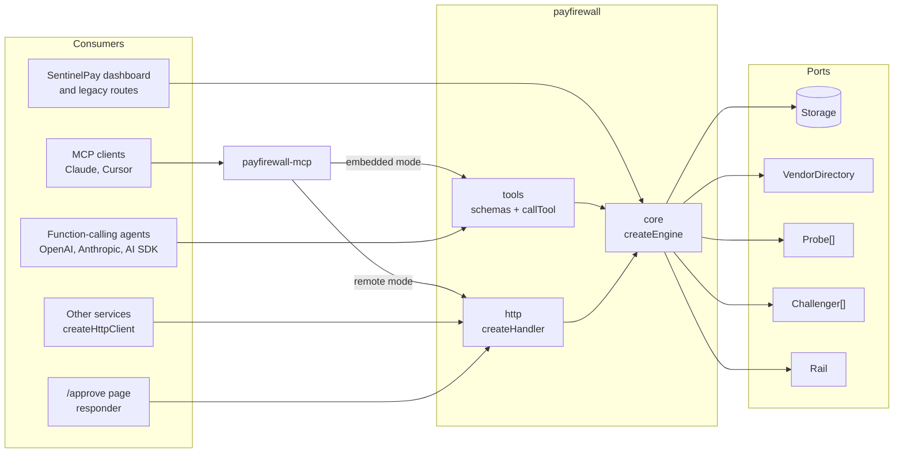
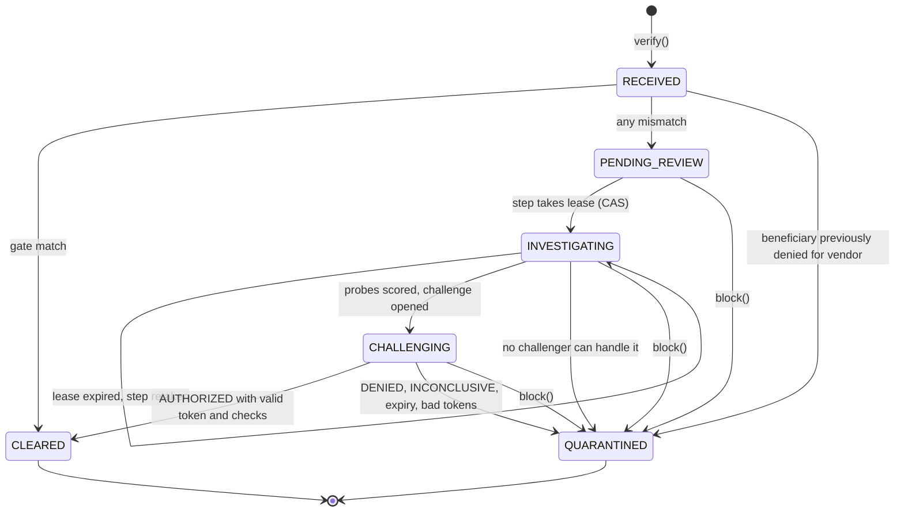
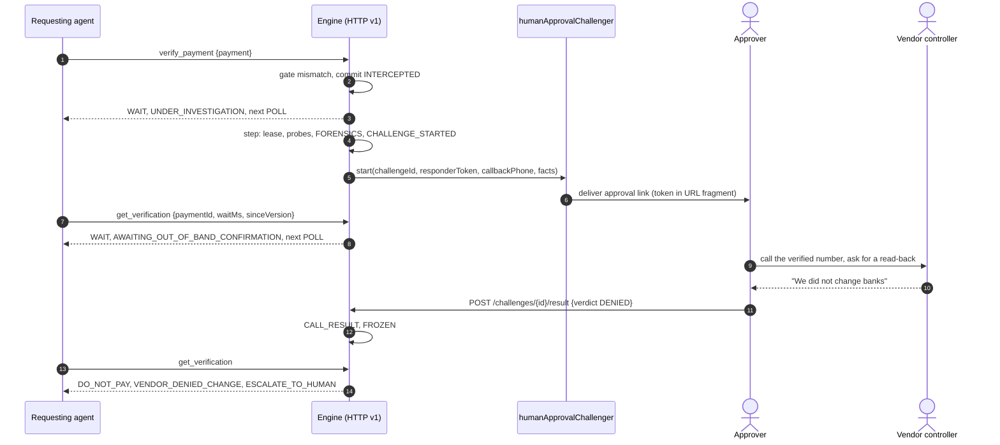
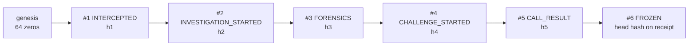

# Architecture

This describes the system as built: **PayFirewall**, a verification engine published as two npm packages, and **SentinelPay**, the Next.js app built on it. The design record is [`ENGINE_SPEC.md`](./ENGINE_SPEC.md) (written before the packages were renamed from `@sentinelpay/*` to `payfirewall` and `payfirewall-mcp`); the original pre-engine design lives in [`References/ARCHITECTURE.md`](../References/ARCHITECTURE.md).

**Design rules**

1. **Money must not move to a changed beneficiary until someone confirms the change on a channel the requester does not control.** Anything short of an explicit, channel-bound authorization freezes the payment.
2. **The money decision is deterministic.** A string-comparison gate, a pure rules policy and a state machine decide. Models research and converse; they never set a verdict.
3. **The engine is the product.** The dashboard, MCP, function calling and HTTP are consumers of one engine and one schema source.
4. **Fail closed, and prove it.** Every failure path ends in `WAIT` or `DO_NOT_PAY`, and every transition is hash-chained.
5. **Offline must still work.** Every external dependency has a recorded fallback, so the demo survives with the network off.

---

## 1. Packages and consumers

```text
sentinelpay/                          repo root = the SentinelPay Next.js app (private, deployed to Vercel)
├─ app/                               dashboard, /approve page, legacy routes, /api/v1 mount
├─ src/lib/engine.ts                  env -> EngineConfig -> createEngine (src/lib/db.ts reads only the database URL)
├─ src/lib/voice/browser-challenger.ts  voice_browser Challenger (app code, React stays out of the engine)
├─ packages/engine/                   payfirewall       (published: ESM + CJS + .d.ts, zero runtime deps)
│  └─ src/
│     ├─ core/                        engine, gate, policy, state, next-actions, token, hash, view, validate, config
│     ├─ challengers/                 humanApprovalChallenger
│     ├─ tools/                       JSON Schemas, callTool, OpenAI / Anthropic / AI SDK adapters
│     ├─ http/                        createHandler (Request -> Response), createHttpClient, OpenAPI
│     ├─ adapters/                    memory, libsql, rdap, tavily, fixtures, column, elevenlabs
│     └─ testing/                     scriptedChallenger, pendingChallenger, fixedClock, seqIds, runStorageContract
└─ packages/mcp/                      payfirewall-mcp   (published: ESM, bin payfirewall-mcp)
   └─ src/                            server (tools, resources, prompt), bin, config
```



The engine never reads `process.env`, never imports a framework, and imports `node:*` only in the `node:test` storage contract suite. It uses Web Crypto and `fetch`, so the core runs on Node 20+ and edge runtimes. The app consumes engine **source** (`transpilePackages` plus tsconfig paths); `dist` is only built for publishing, so a packaging mistake cannot take the Vercel build down.

## 2. Public API

```ts
interface PayFirewall {                       // what requesters (agents, AP systems) get
  verify(payment, opts?): Promise<Verification>;
  get(paymentId, opts?): Promise<Verification>;        // long-poll with waitMs / sinceVersion
  block(paymentId, { reason }): Promise<Verification>;
  receipt(paymentId): Promise<Receipt>;
}

interface Engine extends PayFirewall {        // what the host gets
  advance(paymentId): Promise<Verification>;           // one idempotent step
  sweep(opts?): Promise<{ advanced; expired }>;        // step every open case
  resolveChallenge(input): Promise<Verification>;      // responder ingress
  verifyLedger(): Promise<{ ok; brokenAt?; length }>;
  withPrincipal(principal): Engine;
}
```

`createHttpClient` implements `PayFirewall` over HTTP, so every adapter that takes a `PayFirewall` (tools, MCP) works against a remote engine unchanged. A `Verification` carries `decision` (`PAY` / `DO_NOT_PAY` / `WAIT`), one `reason` code, ordered `nextActions` (do `nextActions[0]`), `mustNot`, the attacker-controllable text isolated under `untrusted`, and `proof.ledgerHeadHash`.

## 3. Ports

| Port | Methods | Shipped implementations | Contract |
|---|---|---|---|
| `Storage` | `load`, `commit`, `ledger`, `list` | `memoryStorage`, `libsqlStorage` | `commit(next, expectedVersion, events)` is compare-and-set: the case write and the ledger appends succeed together or not at all; a stale version throws `VERSION_CONFLICT`. `runStorageContract` tests any adapter. |
| `VendorDirectory` | `get` | `memoryVendors`, `libsqlVendors` | The vendor master. Probes never write it. |
| `Probe` | `run({ payment, vendor, signal, now })` | `rdapProbe`, `tavilyProbe`, `fixtureProbe`, `withFallback` | Returns signals tagged `origin: "live" \| "fixture"`. Timeouts abort through `signal`; a throw becomes a `probe_error` signal. |
| `Challenger` | `canHandle`, `start`, optional `poll`, `cancel` | `humanApprovalChallenger`; app: `browserVoiceChallenger`; tests: `scriptedChallenger`, `pendingChallenger` | `start` receives the responder token and returns `resolved` or `pending`. |
| `Rail` | `release`, optional `readBeneficiary` | `columnRail` (sandbox only) | Called only after `CLEARED` commits, with the key `${railIdempotencyPrefix}-${paymentId}`. |

## 4. Lifecycle state machine



- **Transitions are a pure table** (`core/state.ts`). Terminal states accept nothing; after `CLEARED` only `rail.status` may change.
- **Decision is derived, never stored:** `QUARANTINED` is `DO_NOT_PAY`; `CLEARED` is `PAY`, except a `RAIL_BENEFICIARY_DRIFT` failure, which is `DO_NOT_PAY`; everything else is `WAIT`.
- **Every step is `load → pure decision → storage.commit(next, version, events)`.** A `VERSION_CONFLICT` makes the loser reload and observe that the work is done, so concurrent requests, `after()` callbacks and sweeps never double-apply a step.
- **Lazy progress.** Each `get`, `advance`, `resolveChallenge` and `sweep` enforces leases, challenge expiry, start retries and `challenger.poll()`. No cron is needed for correctness.

| Step | Ledger events, committed with the state change |
|---|---|
| Gate match | `CLEARED`, then later `RAIL_RELEASED` or `RAIL_ERROR` |
| Gate mismatch | `INTERCEPTED {mismatches, onFile, claimed}` |
| Investigation lease | `INVESTIGATION_STARTED` |
| Probes scored, challenge opened | `FORENSICS {risk}`, `CHALLENGE_STARTED {dial, challengeId, channel, assurance, expiresAt}` |
| Resolution | `CALL_RESULT {verdict, answers, evidence, resolvedBy, authorizedWithToken}`, then `FROZEN` or `CLEARED` |
| Block | `CALL_RESULT {verdict: DENIED, reason: BLOCKED_BY_PRINCIPAL}`, `FROZEN` |
| Expiry | `CALL_RESULT {verdict: INCONCLUSIVE, reason: CHALLENGE_EXPIRED}`, `FROZEN` |
| Rejected token or self-approval | `RESPONDER_TOKEN_REJECTED` |
| Same key, different request | `IDEMPOTENCY_CONFLICT` |

### Gate and policy

The gate (`core/gate.ts`) holds on `BENEFICIARY_CHANGED` (last 4, or an HMAC account fingerprint when both sides have one) or `DOMAIN_MISMATCH`. When a rail with `readBeneficiary` is configured, the rail's counterparty overrides the caller's beneficiary before the gate runs.

The policy (`core/policy.ts`, `rules-v1`) is a pure function:

| Rule | Signal | Condition | Points |
|---|---|---|---|
| `young_domain` | `domain_age_days` | registered under 30 days ago, or no registry record | +50 |
| `entity_mismatch` | `entity_match` | request domain not linked to the verified legal entity | +20 |
| `phone_unverified` | `verified_phone` | no registry number, or the invoice number differs | +20 |
| `sanctions` | `sanctions_hit` | beneficiary on a sanctions list | +40 |

Score is capped at 100; ≥ 60 is CRITICAL, ≥ 30 ELEVATED, else LOW. A signal no probe produced is scored as adverse, and a failed probe adds `PROBE_FAILED` without lowering anything. The score explains risk; it never authorizes. Every mismatch is challenged, including LOW.

## 5. Headless challenge sequence



1. **Open.** The first challenger whose `canHandle` passes gets the case. The engine mints `challengeId` (`chl_` + 16 random bytes, base32) and a responder token (32 random bytes, base64url), stores only `sha256(pepper || token)`, and commits `CHALLENGE_STARTED` **before** calling `start()`, so a crash never leaves an unrecorded challenge.
2. **Start failures** clear the token hash; the next step mints a fresh token and retries, up to 3 attempts, then `QUARANTINED` with `CHALLENGE_INCONCLUSIVE`.
3. **Pending.** The requester sees `WAIT` with `POLL` then `AWAIT_OUT_OF_BAND`. A restarted agent needs only the `paymentId`; re-sending the identical payment returns the same case.
4. **Resolve.** Push through `resolveChallenge` (the `/challenges/{id}/result` route or host code), or pull through `challenger.poll()`. First writer wins; a late verdict sees the terminal case unchanged.
5. **Expire.** `challengeTtlMs` (15 minutes by default) passing without an answer freezes the payment with `CHALLENGE_EXPIRED`.

With `AUTHORIZED`, the engine then re-reads the beneficiary at the rail and releases, or records drift and stops.

## 6. The responder-token rule and assurance tiers

| Verdict | Accepted from | Authentication |
|---|---|---|
| `AUTHORIZED` | The responder channel only: `POST /challenges/{id}/result`, `challenger.poll()`, or host ingress calling `resolveChallenge` | The responder token, compared in constant time against the stored hash; challenge `OPEN`, not expired, state `CHALLENGING` |
| `DENIED`, `INCONCLUSIVE` | Any authenticated principal: `block_payment`, the result route with an API key, host routes | API key or session. Moving toward safety is always allowed. |

- **The requester never holds the token.** It is absent from `Verification`, receipts, ledger payloads, `EngineEvent`, errors and every tool schema; no requester surface has an `AUTHORIZED` value or a token field.
- **Identity comes from authentication.** `createHandler.authenticate` maps credentials to a `Principal`; body fields `principal`, `requestedBy` and `resolvedBy` are refused.
- **No self-approval.** A person-authenticated responder whose id equals `requestedBy` gets `SELF_APPROVAL_FORBIDDEN`, logged as `RESPONDER_TOKEN_REJECTED`.
- **Token-only posts are channel-authenticated, not person-authenticated.** The controls are that the requester never receives the token, that `deliver()` targets a channel the requester cannot read, the recorded tier, and `requireApproverSession` (default on in production), which rejects token-only `AUTHORIZED`.
- **Bad tokens** count toward `maxTokenAttempts` (5); the last one expires the challenge.
- **Answers only downgrade:** `authorizedChange: "no"` forces `DENIED`; `"unclear"`/`"no_answer"` or `amountConfirmed: false` force `INCONCLUSIVE`; `human_approval` requires `beneficiaryLast4ReadBack` to equal the case last 4, else `DENIED`. SentinelPay's `voice_browser` challenger sets `requireReadBack` too: the agent is never given the new digits, and `approve_payment` carries what the vendor read.

| Tier | Channel | Where the token goes | Production |
|---|---|---|---|
| `test` | `scripted` | Nowhere; resolves in `start()` | Refused; elsewhere needs `allowTestChallengers: true` |
| `operator_session` | `voice_browser` (SentinelPay) | The operator's browser via `/api/voice/token`; stored server-side in `voice_sessions` until resolved or expired | Only with `operatorAuth: true`. In production SentinelPay's `/api/voice/token` and `/api/governor/decide` require an operator API key, and the decide route passes that operator to `resolveChallenge` as the responder, which satisfies `requireApproverSession` and applies the self-approval check. The bundled dashboard has no operator sign-in, so in practice it cannot clear a voice challenge in production; a host holding an operator key can. |
| `out_of_band` | `human_approval`, `voice_phone`, custom | The confirming party's channel | Allowed |

## 7. Storage: compare-and-set plus ledger



```text
entryHash = SHA-256( seq | paymentId | event | payloadJson | prevHash )
```

- **`libsqlStorage`** keeps a `cases` table (`paymentId` primary key, unique `idempotencyKey` and `challengeId`, `version`, `state`, `vendorId`, JSON body) and a global `ledger` table (`seq` primary key). One write transaction does `UPDATE … WHERE paymentId = ? AND version = ?` (or `INSERT` at version 0), reads the chain tail, appends the entries and runs the host's `onCommit` hook. Zero rows affected or a uniqueness violation is `VERSION_CONFLICT`; any throw rolls everything back. Commits are also serialized per process.
- **`memoryStorage`** runs every commit through one promise queue and computes the whole append before mutating, so a failure leaves no trace.
- **The payload is hashed as the exact stored string** (`payloadJson`), so verification never depends on re-serialization.
- `verifyLedger()` walks the whole chain, checks `prevHash` links, recomputes every hash and reports `brokenAt`. It detects edits to history; it does not stop a full rewrite by someone with write access, so anchor `proof.ledgerHeadHash` externally.
- Idempotency: `verify` is keyed by `idempotencyKey ?? payment.id` plus a request fingerprint. Same key and fingerprint returns the existing case with no new entries; a changed request is `409 IDEMPOTENCY_CONFLICT` and is logged on the existing case, because an account swap on retry is an attack signal.

SentinelPay passes an `onCommit` hook that mirrors the case into its `payments` table inside the same transaction, so the dashboard queue can never disagree with the engine.

## 8. HTTP v1

`createHandler(engine, { authenticate, schedule?, health?, basePath? })` returns a `(Request) => Response` handler. SentinelPay mounts it at `app/api/v1/[...path]/route.ts`, with `schedule` bound to Next's `after()` and API keys from `SENTINELPAY_API_KEYS`.

| Method and path | Auth | Notes |
|---|---|---|
| `POST /verifications` | API key | `{payment, waitMs?}`, `Idempotency-Key` header. 201 created, 200 existing |
| `GET /verifications/{paymentId}` | API key | `?waitMs=&sinceVersion=`, `ETag`, `If-None-Match` → 304, `Retry-After` on `WAIT` |
| `POST /verifications/{paymentId}/block` | API key | `{reason}` |
| `GET /verifications/{paymentId}/receipt` | API key | Receipt |
| `POST /challenges/{challengeId}/result` | Responder token (`AUTHORIZED`) or API key/session (`DENIED`, `INCONCLUSIVE`) | Not a tool, not in `/tools` |
| `GET /ledger/verify` | API key | `{ok, brokenAt?, length}` |
| `GET /tools`, `GET /openapi.json`, `GET /health` | none | Tool definitions, OpenAPI 3.1, host-described configuration |

Errors are `{ error: { code, message, retryable, path?, nextActions } }` with the engine's HTTP status (400, 401, 403, 404, 409, 410, 503). Anything that is not a coded engine error becomes a retryable `STORAGE_UNAVAILABLE` with its message withheld. Reads are scoped: another principal's payment is `404`, so existence and amounts do not leak. Bodies over 64 KB are refused.

## 9. MCP

`payfirewall-mcp` uses the SDK's low-level `Server` over stdio with the engine's own schemas and `callTool`, so MCP cannot drift from function calling or HTTP.

- **Tools:** `verify_payment`, `get_verification`, `block_payment`, each with an `outputSchema`. Results carry a one-line summary and the full object as `structuredContent`; errors set `isError` with the error envelope.
- **Resources:** `payfirewall://policy`, `payfirewall://verifications/{paymentId}`, `payfirewall://verifications/{paymentId}/receipt`.
- **Prompt and instructions:** `verify-before-paying`.
- **Remote mode** (`PAYFIREWALL_URL`, `PAYFIREWALL_API_KEY`) wraps `createHttpClient`; `https` is required except on loopback. **Embedded mode** (`--config module`) builds an engine from the module's default export and runs `sweep()` every 5 seconds while a client is connected. The bin reads no other environment and writes diagnostics only to stderr.

## 10. SentinelPay on the engine

| Piece | Role |
|---|---|
| `src/lib/engine.ts` | Reads the environment, builds probes, challengers, rail and storage, and exposes `getRuntime()`. Apart from the database URL in `src/lib/db.ts`, the only env reader. |
| `/api/release`, `/api/webhook`, `/api/investigate`, `/api/block`, `/api/governor/decide`, `/api/voice/token`, `/api/incident/[id]`, `/api/stream`, `/api/reset` | Dashboard and legacy routes as thin wrappers over `verify`, `advance`, `block`, `resolveChallenge` and `receipt`. `/api/governor/decide` needs `challengeId`, `responderToken` and the vendor's read-back for `AUTHORIZED`. Outside production they act as the app principals; in production each requires an operator API key (`src/lib/auth.ts`), and `/api/reset`, the dashboard page and the `/incident/[id]` page are not served. |
| `/api/v1/[...path]` | `createHandler` mount for agents and `payfirewall-mcp` remote mode |
| `/approve/[challengeId]` | Responder page for `humanApprovalChallenger`. The token stays in the URL fragment, which never reaches the server. The server renders the same neutral shell for every id; the page loads the payment details from `GET /api/approve/[challengeId]` with the token as bearer (one 401 for a bad token or unknown id), posts `AUTHORIZED` with the read-back to `/api/v1/challenges/{id}/result`, and posts "Not confirmed" with the token to `/api/approve/[challengeId]`, which is refused in production until approver sessions exist. The receipt omits the challenge id while the challenge is open. |
| `onEvent` sink | Formats engine events into the investigation terminal, and records a registry-verified phone in the vendor master (never over a `vendor_master` number, and only from live evidence in production) |
| Challengers | `human_approval` when `APPROVAL_DELIVERY=log` (sandbox only), then `voice_browser` |
| Rail | `columnRail` when `PAYMENT_SOURCE=column` and its preconditions hold; otherwise none, and the host treats `PAY` as release |
| Dashboard refresh | Deviation from ENGINE_SPEC §6.3, which plans per-case long-polls on `/api/v1`: the dashboard still polls the `/api/stream` snapshot, every 1 s while a wire is being verified and every 5 s when all wires are idle. The snapshot re-verifies the whole chain when a new ledger entry is written and otherwise once a minute, so an in-place edit of an old row can take up to a minute to show in the header. The receipt and `/api/v1/ledger/verify` always recompute. |

## 11. Offline and fallback matrix

| Dependency | `DEMO_MODE=cache` | `live`, healthy | `live`, failing or no key |
|---|---|---|---|
| RDAP | `fixtureProbe("rdap")` | `rdapProbe` | `withFallback` to the fixture, noted in the terminal |
| Tavily | `fixtureProbe("tavily")` | `tavilyProbe` | fixture; outside production also when a live search finds no registry phone |
| ElevenLabs | scripted browser call on the same tools | WebRTC agent with a single-use conversation token | scripted call, reason shown in the console |
| Column | no rail | sandbox rail | no rail, reason on the header badge |
| Database | local `sentinel.db` | Turso | ephemeral `/tmp` file on Vercel without Turso, logged as an error |

Fixture evidence is tagged `origin: "fixture"` all the way into the receipt. In production, without `allowFixtureData`, it adds `FIXTURE_DATA` and cannot clear a payment.

## 12. Security notes

- **Secrets stay server-side.** At runtime, Tavily, ElevenLabs and Column keys are read only in `src/lib/engine.ts` (the setup and capture scripts read them locally); the browser receives a single-use ElevenLabs token and, for `voice_browser`, the responder token of the one open challenge.
- **Unsafe configuration is refused at construction:** pepper under 32 bytes, test challengers in production or without opt-in, `voice_browser` in production without operator auth, mismatched rail environment. The app adds: `APPROVAL_DELIVERY=log` and a missing pepper are refused in production; `columnRail` refuses non-`test_` keys.
- **The invoice's phone number is stored as untrusted text and never dialed.** The callback number is the vendor master's, else a registry-verified candidate; with neither, the case ends `NO_CHALLENGE_CHANNEL`.
- **A previously denied beneficiary** for the same vendor is quarantined immediately unless an operator re-verifies, so an agent cannot retry with fresh payment ids until a challenge passes.
- **Rail release is ordered for safety:** `CLEARED` is committed first, the beneficiary is re-read at the rail, drift stops the release with `DO_NOT_PAY`, and the idempotency key keeps a retry from sending a second wire.
- **Legacy routes fail closed in production.** They need an operator API key; the dashboard and printable receipt, which a browser cannot authenticate, are not served. Attacker-supplied `requestSourceDomain` reaches the voice agent only as a quoted, hostname-validated variable (the webhook refuses anything else).
- **Known gaps:** production approvals need real approver sessions (the app has API-key principals only), and the operator console has no sign-in, so it is sandbox-only; `APPROVAL_DELIVERY=log` is a sandbox stand-in for a real delivery channel; the ledger head is not yet anchored outside the database; there is no multi-tenant isolation.
