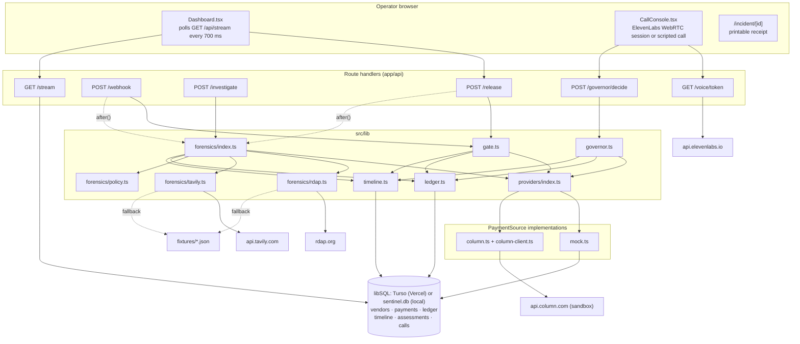
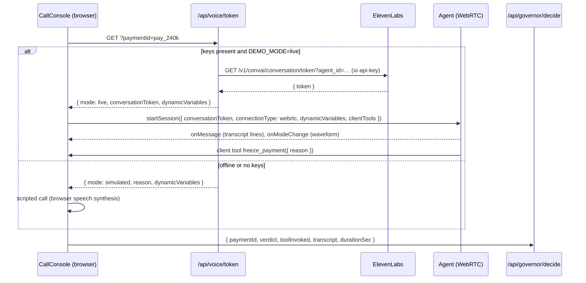
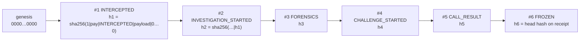
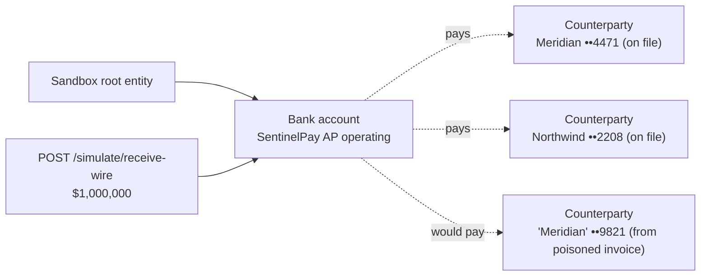

# SentinelPay architecture

This describes the system as built. The original pre-build design lives in [`References/ARCHITECTURE.md`](../References/ARCHITECTURE.md).

**Design goals**

1. **One repo, one language, one process.** Next.js serves the dashboard and the API. One libSQL database holds all state: hosted Turso on Vercel, a local SQLite file offline.
2. **The money decision is deterministic.** Rules decide risk and a fail-closed governor decides state. Models only research and converse.
3. **Every external call has a fallback.** `DEMO_MODE=cache` runs the whole path with the network off.
4. **Contracts first.** Every module builds against `src/lib/types.ts`, and rails plug in behind `PaymentSource`.

---

## 1. Component map



## 2. Pipeline nodes

### ① Interception gate (`src/lib/gate.ts`)

- **Input:** a payment in `RECEIVED`, from the operator's Release click (`/api/release`) or an AP event (`/api/webhook`).
- **Rule:** hold if `claimedBankLast4 ≠ vendor.knownBankLast4` **or** `requestSourceDomain ≠ vendor.knownDomain`.
- **Output:** `PENDING_REVIEW` with an `INTERCEPTED` ledger entry (mismatches, on-file vs claimed values). The route schedules forensics with Next's `after()` so the HTTP response returns immediately. A match goes to `CLEARED`.
- **Idempotent:** a payment that isn't `RECEIVED` is returned unchanged.

### ② Forensics engine (`src/lib/forensics/`)

Three probes run concurrently with `Promise.all`:

| Probe | Call | Extracted signal |
|---|---|---|
| `rdap.ts` (request domain) | `GET https://rdap.org/domain/{domain}` | `domain_age_days` from the `registration` event. `null` when the registry has no record. |
| `rdap.ts` (vendor domain) | same | Contrast line only ("registered 27 years ago") |
| `tavily.ts` | 2 × `POST https://api.tavily.com/search`, `search_depth: advanced` | `entity_match`, `verified_phone`, `adverse_media` |

**Tavily queries**

1. `"{legalName} headquarters corporate phone"` with `include_domains: [sec.gov, opencorporates.com, bloomberg.com]`
2. `"{requestSourceDomain} whois legitimacy"`

**Extraction (`extractFindings`, a pure function used for both live and cached data)**

- *Entity resolved:* a registry result mentions the legal name, ignoring the LLC/Inc suffix.
- *Verified phone:* the most frequently cited US number across entity results, **excluding the invoice number** and `000` placeholders.
- *Entity match:* the request domain equals the vendor-of-record domain, or appears in an entity result.

**RDAP edge cases handled**

| Situation | rdap.org response | Handling |
|---|---|---|
| Domain exists | 200 with events | Live age |
| Domain doesn't exist | 404 | `found: false`, scored like a new domain (+50) |
| TLD has no RDAP server (e.g. `.co`) | 404 "No RDAP service…" | Not evidence either way, so use the fixture, tagged `[cached]` |
| Missing User-Agent | 403 (Cloudflare) | Every request sends a User-Agent |
| Network down | throws | Fixture fallback |

### Risk policy (`src/lib/forensics/policy.ts`)

```text
score = 0
domain_age_days < 30 or no registry record      → +50
entity_match == false                            → +20
verified_phone missing or ≠ invoice phone        → +20
sanctions_hit == true                            → +40
score = min(score, 100)
level = score ≥ 60 → CRITICAL | score ≥ 30 → ELEVATED | LOW
```

The rationale is templated from the triggered rules. It's reproducible and auditable, with no model involved.

After scoring, the payment moves to `CHALLENGING` and a `CHALLENGE_STARTED` entry records the number to dial. Even a LOW score is challenged: a beneficiary change always needs confirmation.

### ③ Voice challenge (`src/lib/voice/`, `CallConsole.tsx`, `/api/voice/token`)



- **Dynamic variables:** `payer`, `amount`, `vendor`, `newLast4`, `oldLast4`, `request_domain`, `callback_number`, `payment_id`.
- **Verdict mapping:** `approve_payment` → `AUTHORIZED`. `freeze_payment` → `DENIED`, or `INCONCLUSIVE` when the reason says so.
- **Security:** the ElevenLabs API key stays server-side, and the browser only gets a single-use conversation token.
- The agent prompt and tool schema are version-controlled in `agent.config.md`. The tools must also be registered on the agent in the ElevenLabs dashboard.

### ④ Settlement governor (`src/lib/governor.ts`)

| Current state | Verdict | Result |
|---|---|---|
| `QUARANTINED` / `CLEARED` | any | No change. Returns the existing receipt (idempotent tool calls). |
| `RECEIVED` | any | 409: payment has not been through the gate |
| `PENDING_REVIEW` / `INVESTIGATING` | `AUTHORIZED` | 409: authorization requires a completed challenge |
| `PENDING_REVIEW` / `INVESTIGATING` / `CHALLENGING` | `DENIED` / `INCONCLUSIVE` | `QUARANTINED` (fail-closed) |
| `CHALLENGING` | `AUTHORIZED` | `CLEARED` |

Each decision appends `CALL_RESULT` followed by `FROZEN` or `CLEARED`.

## 3. Audit ledger (`src/lib/ledger.ts`)



- A single global chain across all payments. Appends run inside a libSQL write transaction, so `seq` and `prevHash` can't race across serverless instances. `seq` is the primary key, so a lost race fails loudly.
- The payload is hashed as the exact stored JSON string.
- `verifyChain()` walks every row, checking `prevHash` linkage and recomputing `entryHash`. It returns `{ ok, brokenAt, length }`. The dashboard runs it on every poll.
- **Threat model:** detects after-the-fact edits to history. It doesn't stop someone with database access from rewriting the whole chain. Anchoring the head hash externally (email to the CFO, a transparency log) is the production step.

## 4. Payment rails (`src/lib/providers/`)

```ts
interface PaymentSource {
  listPending(): Promise<Payment[]>;
  get(id: string): Promise<Payment>;
  setStatus(id: string, status: PaymentStatus): Promise<void>;   // the enforcement hook
}
```

| | Mock rail (`mock.ts`) | Column sandbox rail (`column.ts`) |
|---|---|---|
| AP queue (amount, memo, request domain) | SQLite | SQLite (the AP/ERP side) |
| Beneficiary account | SQLite `claimedBankLast4` | **Live** `GET /counterparties/{id}`, last 4 of `account_number` |
| `setStatus(CLEARED)` | Updates the row | Updates the row **and** `POST /transfers/wire` (Basic auth, `Idempotency-Key: sentinelpay-{id}`), stores `railReference`, ledger `RAIL_RELEASED` |
| `setStatus(QUARANTINED)` | Updates the row | Updates the row. **No wire call**: funds stay in the AP account. |
| Failure handling | n/a | Ledger `RAIL_ERROR` plus a terminal alert. The decision itself stands. |
| Selected when | default | `PAYMENT_SOURCE=column`, `DEMO_MODE=live`, `COLUMN_API_KEY=test_…`, and `.column-sandbox.json` exists |

> Not yet exercised against a real Column sandbox key. `GET /counterparties/{id}`, the `GET /entities` response shape and the `Idempotency-Key` header are inferred from the docs.

Guardrails: `ColumnClient` refuses any key that doesn't start with `test_`. If a precondition is missing, the app falls back to the mock rail and the dashboard badge explains why.

`pnpm column:setup` creates the sandbox objects:



## 5. Data model (libSQL)

`src/lib/db.ts` picks the backend: `TURSO_DATABASE_URL` set → hosted Turso; otherwise `file:sentinel.db` (or `SENTINEL_DB_PATH`). On Vercel without Turso it logs an error and uses an ephemeral `/tmp` file. The schema is created and migrated on first use.

| Table | Columns | Notes |
|---|---|---|
| `vendors` | id, legalName, knownDomain, knownBankLast4, verifiedPhone, registryUrl | Vendor master. `verifiedPhone` is filled by forensics. |
| `payments` | id, vendorId, amountCents, currency, claimedBankLast4, requestSourceDomain, invoiceContactPhone, status, createdAt, memo, railCounterpartyId, railReference | Rail columns are added by migration |
| `ledger` | seq, paymentId, event, payload_json, prevHash, entryHash, ts | Append-only, hash-chained |
| `timeline` | id, paymentId, kind, text, ts | Investigation terminal lines (UI only, not audit) |
| `assessments` | paymentId, json | `RiskAssessment` |
| `calls` | paymentId, json | `CallOutcome` |

## 6. Offline and fallback matrix

| Dependency | `DEMO_MODE=cache` | `live`, dependency healthy | `live`, dependency down or no key |
|---|---|---|---|
| RDAP | `fixtures/rdap.json` | rdap.org | fixture, tagged `[cached]` |
| Tavily | `fixtures/tavily.json` | api.tavily.com | fixture, tagged `[cached]` |
| ElevenLabs | scripted call | WebRTC agent | scripted call, with the reason shown in the console |
| Column | mock rail | sandbox rail | mock rail, with the reason on the header badge |
| Fonts | bundled | bundled | bundled |

## 7. Security notes

- Server-only secrets: Tavily, ElevenLabs and Column keys are read in route handlers and `src/lib` only. The browser receives a single-use ElevenLabs token.
- The invoice's contact phone is persisted for the record but **never dialed**.
- Governor inputs are validated (verdict enum, tool enum, transcript capped at 20 KB).
- Out of scope for the prototype: authentication and RBAC on operator routes, multi-tenant isolation, external anchoring of the ledger head.
